# Modelo de datos — slg_website

Documento de diseño del paso 6 de `init-project`, nivel **HIGH** declarado por el perfil
`software-app`. Es el documento más releído del proyecto: cada migración y cada consulta lo abren.
Por eso cada tabla trae aquí sus columnas con tipo, nulabilidad y defecto; cada índice trae la
consulta que lo justifica; y cada política `ON DELETE` trae su razón.

---

## 0. Cómo se lee este documento

### 0.1 Qué decide y qué no

| Decide aquí | Vive en otro documento |
|---|---|
| Qué tablas existen, con qué columnas, tipos, defectos y restricciones | Endpoints, códigos de estado y alcances por ruta → `api_contracts` |
| Claves primarias, foráneas y su política `ON DELETE` | Qué pantalla muestra cada dato y con qué estados → `ui_wireframes` |
| Índices y la consulta concreta que cada uno sirve | Cómo se comunican los módulos y los servicios → `architecture` |
| Enumerados completos y restricciones `CHECK` | Tokens, tipografía, espaciado, motion → `style_guide` |
| El **modelo de aislamiento** por organización (DoD #5, gate D9) | El copy y las cadenas de interfaz → `content/` |
| El tamaño máximo de subida (cierra RNF-25) | La caducidad de la URL firmada (cierra RNF-20) → `api_contracts` |

### 0.2 Notación de orígenes

Se usa la notación disjunta declarada en `planning/requirements.md`:

- `§N` — sección del brief · `§10-N` — decisión HITL de Ricardo (fila N de §10).
- `A.N` / `B.N` / `C.N` / `F.N` — sección de anexo del brief (`B.2` = modelo de datos, `B.3` = matriz
  de permisos, `B.6-2` = paso 2 del flujo del CRM).
- `D1` … `D12`, `D2b` — gates del Anexo D, sin guion.
- `DoD #N` — prueba N de la Definition of Done (§4).
- `D-14` … `D-24` — decisiones de `docs/decision_log.md`.
- `D-01` … `D-11` — los once documentos de descarga del Anexo A.4 (D-17). **Nunca** aparecen como
  origen: solo como dato dentro de una tabla.
- `R-NN` — riesgo de `planning/risks.md`.

### 0.3 Reglas duras que gobiernan todo el esquema

1. **Nada inventado.** Donde el brief no fija un valor, este documento lo marca `[PENDIENTE: …]` o lo
   declara explícitamente como **decisión de este documento**, con su razón y su necesidad de quedar
   registrada en `docs/decision_log.md`. No hay terceros valores.
2. **El repositorio es público** (§10-6). En este documento hay **nombres** de variables de entorno y
   ningún valor. Ninguna fila de ejemplo contiene datos reales de persona o de cliente.
3. **La web no gestiona pipeline** (§10-13, frontera (a) de `scope.md`). `lead_capture` no tiene
   etapa, propietario, valor de oportunidad ni próximo paso. Cualquier propuesta de añadirlos se
   rechaza en revisión (RF-57).
4. **Nomenclatura literal** (§1 Constraints, RF-14). Donde un valor de datos es una etiqueta de la
   oferta (`project.service`), el enumerado la escribe literal: `SLG_Readiness`, no "readiness".

---

## 1. Inventario y procedencia

### 1.1 El conteo, verificado contra el brief

La tabla B.2 del brief tiene **16 filas**. Una de ellas agrupa tres entidades
(`account` / `session` / `verification`), de modo que las entidades nombradas son **18**. Este
documento define esas 18 más **una** que el brief no nombra y que D-22 hace necesaria
(`email_delivery`, §7): **19 tablas en total**.

| | Conteo | Cómo se obtiene |
|---|---|---|
| Filas de la tabla B.2 | **16** | Filas del cuerpo de la tabla, sin cabecera |
| Entidades nombradas en B.2 | **18** | 15 filas de una entidad + 1 fila con tres (`account`, `session`, `verification`) |
| Tablas definidas aquí | **19** | Las 18 de B.2 + `email_delivery` |
| Vocabularios enumerados cerrados | **19** | §3. Se aplican a **27 columnas** (varios se reutilizan: el rol, el idioma, el vocabulario de cola, el modo del CRM y la nomenclatura literal) |
| Valores literales de `project.service` | **11** | Las 11 páginas de servicio de A.2 (D-17) |

> `implementation/user_units.md` (FU-04) dice «las **dieciséis** entidades de B.2» y lista dieciséis
> nombres porque agrupa `account`/`session`/`verification` como el brief. No hay discrepancia: son
> las mismas entidades contadas de otra forma. Este documento usa siempre **18 entidades / 19 tablas**
> y lo dice cada vez que da un número.

### 1.2 Qué crea Better Auth y qué añadimos nosotros

Better Auth (§7, elección HITL) crea y migra sus propias tablas. La frontera importa porque
actualizar la librería puede regenerar su esquema, y **lo nuestro no puede vivir donde ella escribe
sin declararlo**.

| Tabla | Origen | Qué es suyo | Qué añadimos encima |
|---|---|---|---|
| `user` | Better Auth núcleo + plugin `admin` | `id`, `name`, `email`, `email_verified`, `image`, `created_at`, `updated_at`; del plugin `admin`: `role`, `banned`, `ban_reason`, `ban_expires` | `locale` |
| `session` | Better Auth núcleo + plugins `organization`, `admin` | `id`, `user_id`, `token`, `expires_at`, `ip_address`, `user_agent`, `created_at`, `updated_at`; `active_organization_id` (organization); `impersonated_by` (admin) | — |
| `account` | Better Auth núcleo | `id`, `user_id`, `account_id`, `provider_id`, tokens y `password` | — |
| `verification` | Better Auth núcleo | `id`, `identifier`, `value`, `expires_at` | — |
| `organization` | Better Auth plugin `organization` | `id`, `name`, `slug`, `logo`, `metadata`, `created_at` | `type`, `status`, `primary_contact_user_id`, `updated_at` |
| `membership` | Better Auth plugin `organization` (su tabla se llama `member`) | `id`, `organization_id`, `user_id`, `role`, `created_at` | `organization_type` (desnormalizado, §5.6) |
| `invitation` | Better Auth plugin `organization` | `id`, `organization_id`, `email`, `role`, `status`, `expires_at`, `inviter_id` | `token_hash`, `sent_at`, `accepted_at`, `accepted_by_user_id`, `revoked_at`, `revoked_by_user_id` |
| `api_key` | Better Auth plugin `apiKey` (su tabla se llama `apikey`) | `id`, `name`, `start`, `prefix`, `key`, `user_id`, `enabled`, `rate_limit_enabled`, `rate_limit_max`, `rate_limit_time_window`, `request_count`, `last_request`, `expires_at`, `created_at`, `updated_at`, `permissions`, `metadata` | `organization_id`, `scopes`, `revoked_at`, `revoked_by_user_id`, `created_by_user_id` |
| Las 10 restantes de B.2, más `email_delivery` (§5.19) | **Propias** (11) | — | Todo |

**Tres decisiones de este documento sobre esa frontera**, cada una con su razón:

1. **Renombramos dos tablas del plugin**: `member` → `membership` y `apikey` → `api_key`. Better Auth
   permite mapear nombres de tabla y de campo en su configuración de esquema. Razón: el brief los
   nombra así en B.2 y en B.3, y el `api_contracts`, el `ui_wireframes` y el README operativo los
   citarán con ese nombre. Un nombre distinto en la base de datos que en toda la documentación es una
   trampa para el operador (DoD #9). **Coste asumido**: el mapeo debe reaplicarse si se regenera el
   esquema; queda como ítem de verificación en FU-04.
2. **Los alcances de clave viven en columna propia `scopes text[]`**, no en el campo `permissions` del
   plugin. Razón: `scopes` se consulta y se restringe (`CHECK` de contención, §5.8), y RF-147 exige
   granularidad real desde v1 — un alcance guardado como texto JSON no se puede restringir en la base
   de datos ni indexar. El campo `permissions` del plugin queda sin uso y así se documenta.
3. **Toda columna de fecha es `timestamptz`**, incluidas las de Better Auth. Razón: el activo es
   bilingüe y sirve a LATAM y a EE. UU. (§0); una marca de tiempo sin zona en una cola de reintentos
   (`crm_next_attempt_at`) es un defecto latente. **Coste asumido**: el esquema generado por Better
   Auth debe ajustarse; ítem de verificación en FU-04.

> **Ítem de verificación obligatorio en FU-04.** Las columnas de las tablas de Better Auth listadas
> aquí se declaran **según el esquema de la versión que se fije** (RNF-28 exige versión exacta, R-19
> prohíbe actualizar dentro de un milestone). FU-04 confirma la lista contra esa versión antes de
> escribir la primera migración y corrige aquí cualquier diferencia. Este documento no es la fuente de
> verdad del esquema de la librería; es la fuente de verdad de **lo que añadimos y de cómo lo usamos**.

### 1.3 El rol `agent` no es un usuario

RF-67 nombra cinco roles: `slg_admin`, `slg_operator`, `client_admin`, `client_member` y `agent`.
Los cuatro primeros son valores de `user.role`. **`agent` no es una fila de `user`**: es una fila de
`api_key` con alcances (B.5). No existe ni se creará un usuario con rol `agent`, y el enumerado de
`user.role` lo excluye por `CHECK` (§3.1). Razón: un agente no tiene sesión, ni contraseña, ni
correo, ni pertenencia; darle una fila en `user` obligaría a nulos por todas partes y abriría el
camino a que un agente aparezca en una lista de miembros de empresa.

---

## 2. Convenciones globales

### 2.1 Identificadores

| Decisión | Valor | Razón |
|---|---|---|
| Tipo de clave primaria | `text` en **todas** las tablas | Better Auth genera identificadores de cadena para sus tablas. Diez de nuestras tablas tienen clave foránea a `user` o a `organization`. Un esquema mixto (`uuid` propio, `text` ajeno) obliga a convertir en cada unión y es el origen clásico de un `WHERE` que no filtra nada. Un solo tipo de unión en todo el esquema vale los 20 bytes de más por fila. |
| Generación en tablas propias | UUID v7 renderizado como texto, generado en la aplicación | Ordenable por tiempo (los índices de inserción no se fragmentan) y opaco hacia fuera: un identificador correlativo en `/api/v1/organizations/{id}` invita a enumerar. |
| Generación en tablas de Better Auth | La de la librería | No se toca lo que la librería genera. |
| Longitud | `text` sin límite, con `CHECK (length(id) between 8 and 64)` | Postgres no gana nada con `varchar(n)`; el `CHECK` documenta el rango y ataja una inserción absurda. |

### 2.2 Fechas y husos

- Toda columna de instante es `timestamptz`. Toda columna de fecha civil (ninguna en v1) sería `date`.
- `created_at timestamptz NOT NULL DEFAULT now()` en las 19 tablas.
- `updated_at timestamptz` solo donde algo se actualiza de verdad. Las tablas de evidencia
  (`audit_log`, `download_event`, `crm_delivery`, `agent_event`) **no la tienen**: no se actualizan.

### 2.3 Enumerados: `text` + `CHECK`, no tipo `ENUM` nativo

**Decisión de este documento.** Todo enumerado cerrado se implementa como columna `text` con una
restricción `CHECK (col IN (…))` nombrada. Razones:

1. **Se revisa en el diff.** Un `CHECK` nombrado aparece entero en la migración; un `ALTER TYPE` no
   dice qué valores tenía antes el tipo.
2. **Se cambia en una transacción.** Añadir o retirar un valor es `DROP CONSTRAINT` + `ADD CONSTRAINT`
   dentro de una sola migración transaccional, junto con la migración de datos que lo acompaña. Con
   tipo nativo, retirar un valor obliga a recrear el tipo y a reescribir todas las columnas que lo usan.
3. **No hay orden implícito.** Un tipo nativo tiene orden por posición de declaración, y ese orden se
   cuela en un `ORDER BY` sin que nadie lo decida.

**Excepción declarada**: `agent_event.kind` **no lleva `CHECK`** — RF-146 exige que sea un valor
abierto. Su disciplina es de escritura, no de esquema (§5.14).

**Coste asumido**: la base de datos no ofrece la lista de valores por introspección de tipo. Se
compensa con una constante única por enumerado en el código, derivada del mismo sitio que la
migración, y con la prueba de esquema de §6.6.

### 2.4 Actor polimórfico sin clave foránea

Cuatro columnas del brief nombran «un usuario **o** una clave de API»: `audit_log.actor`,
`deliverable.published_by`, `announcement.author` y, por coherencia, el remitente de
`email_delivery`. Se modelan siempre con el mismo trío:

| Columna | Tipo | Nulo | Propósito |
|---|---|---|---|
| `<x>_actor_type` | `text` | NO | `user` · `api_key` · `system` (§3.11) |
| `<x>_actor_id` | `text` | NO | Identificador del actor. **Sin clave foránea, a propósito.** |
| `<x>_actor_label` | `text` | NO | Nombre legible en el momento del hecho (nombre de persona o de clave) |

**Por qué sin clave foránea.** Una clave foránea a `user` obliga a elegir entre `CASCADE` (borrar un
usuario reescribe la historia: prohibido por RNF-29) y `RESTRICT` (nunca se puede borrar un usuario,
que es lo que de hecho queremos, pero entonces la clave foránea no aporta). Sin clave foránea, la
historia es inmutable por construcción y no depende de que nadie elija bien la política. El
`_actor_label` desnormalizado hace que la fila siga siendo legible aunque el actor desaparezca — que
es justo lo que un registro de auditoría debe garantizar.

**Coste asumido**: no hay integridad referencial sobre el actor. Se compensa con la validación en la
única capa de escritura (§6) y con la prueba de esquema que exige el trío completo en toda tabla que
lo use.

### 2.5 Nada se borra: se archiva

No existe en la aplicación ningún camino de borrado para `organization`, `project`, `deliverable`,
`lead_capture`, `download`, `download_event`, `crm_delivery`, `agent_event`, `audit_log`,
`webhook_delivery` ni `email_delivery`. Archivar es cambiar `status`. Consecuencia directa sobre las
políticas `ON DELETE`, desarrollada en §4.

### 2.6 Tamaño máximo de subida — cierra RNF-25

RNF-25 exige que el número se fije **aquí**. FU-04 (criterio 8) exige además que exista como
constante única referenciada desde el código, no repetida a mano. Se fija así:

| Destino | Tipos MIME aceptados | Tamaño máximo | Razón del número |
|---|---|---|---|
| Bucket `downloads` (documentos D-01…D-11) | `application/pdf` | **25 MB** | Un documento de autoridad para C-suite es texto y diagramas; 25 MB cubre con holgura un PDF de 40 páginas con imágenes y sigue siendo descargable en móvil desde LinkedIn (DoD #1). |
| Bucket `deliverables`, tipo `pdf` y `material` | `application/pdf`, `application/pdf` + los MIME que FU-09 fije para material | **50 MB** | Un entregable de proyecto puede llevar anexos; el doble del documento público. |
| Bucket `deliverables`, tipo `html` | `text/html` | **5 MB** | Es HTML **autocontenido** que se abre en un visor aislado (R-11, RNF-21). Por encima de unos pocos MB el visor deja de ser usable y el archivo deja de poder revisarse antes de publicarlo. |
| Bucket `deliverables`, tipo `md` | `text/markdown` | **1 MB** | Markdown OKF; un megabyte son cientos de páginas de texto. |
| Tope duro del servidor y del proxy | — | **50 MB** | Ninguna petición de subida supera el mayor de los anteriores. Rechaza antes de leer el cuerpo. |

Cada número se valida **en el servidor** antes de aceptar el archivo (RNF-25), y el valor aceptado se
persiste en `deliverable.size_bytes` / `download.size_bytes` como evidencia. El presupuesto total
también importa: el tramo gratuito del destino de backups elegido en D-21 es de 10 GB-mes, y los
entregables entran en la copia (R-12); con estos topes, 200 entregables de tamaño máximo caben dentro.

> **Requiere entrada en `docs/decision_log.md`.** El brief no da estos números; los fija este
> documento por mandato de RNF-25. La entrada debe registrar los cinco valores y su razón.

---

## 3. Enumerados — exactos y completos

**Diecinueve** vocabularios cerrados, aplicados a **27 columnas** —cinco se reutilizan en más de una
columna y por eso hay menos vocabularios que columnas—. De cada uno: los valores, de dónde salen y qué
pasa al añadir uno. **Fuera de esta lista no hay ningún otro enumerado cerrado en el esquema**, y
`agent_event.kind` está deliberadamente abierto (§3.11).

| # | Vocabulario | Columnas que lo usan | Sección |
|---|---|---|---|
| 1 | rol de persona | `user.role`, `invitation.role` | §3.1 |
| 2 | tipo de organización | `organization.type`, `membership.organization_type` | §3.2 |
| 3 | estado de organización | `organization.status` | §3.3 |
| 4 | estado de proyecto | `project.status` | §3.3 |
| 5 | rol dentro de la organización | `membership.org_role` | §3.4 |
| 6 | estado de invitación | `invitation.status` | §3.5 |
| 7 | alcances de clave | `api_key.scopes` | §3.6 |
| 8 | origen de la captura | `lead_capture.source` | §3.7 |
| 9 | **estado de cola** | `lead_capture.crm_sync_status`, `webhook_delivery.status`, `email_delivery.status` | §3.8, §3.9 |
| 10 | modo de entrega al CRM | `lead_capture.crm_mode`, `crm_delivery.mode` | §3.8 |
| 11 | estado del documento | `download.status` | §3.10 |
| 12 | tipo de entregable | `deliverable.type` | §3.10 |
| 13 | visibilidad | `deliverable.visibility` | §3.10 |
| 14 | origen del contenido | `deliverable.source` | §3.10 |
| 15 | tipo de actor | `audit_log.actor_type` (y los actores polimórficos de §2.4) | §3.11 |
| 16 | evento saliente | `webhook_delivery.event` | §3.11 |
| 17 | tipo de correo | `email_delivery.kind` | §3.12 |
| 18 | servicio (nomenclatura literal) | `project.service`, `download.service` | §3.13 |
| 19 | idioma (`es` · `en`) | `user.locale`, `lead_capture.locale`, `email_delivery.locale` | §5.1, §5.9, §5.19 |

### 3.1 `user.role` — rol global de la persona

| Valor | Significado |
|---|---|
| `slg_admin` | Ricardo. Único rol que crea claves de API, invita usuarios SLG y lee auditoría (B.3) |
| `slg_operator` | Jessica y asociados. Opera solo sobre proyectos asignados (B.3) |
| `client_admin` | Persona de una empresa cliente que puede invitar a miembros de **su** empresa |
| `client_member` | Persona de una empresa cliente, solo lectura de lo suyo |

Origen: §5.1, B.3, RF-67. **`agent` no está y no estará** (§1.3).
`CHECK user_role_valid: role IN ('slg_admin','slg_operator','client_admin','client_member')`.

### 3.2 `organization.type`

| Valor | Significado |
|---|---|
| `client` | Empresa cliente |
| `slg` | SLG Agency. **Una sola fila** en toda la base (índice único parcial, §5.5) |

Origen: B.2 («SLG es una organización de tipo `slg`»).

### 3.3 `organization.status` y `project.status`

**Decisión de este documento** — el brief pide «estado» (B.2, RF-77, RF-79) sin enumerarlo.

`organization.status`:

| Valor | Significado |
|---|---|
| `active` | Opera con normalidad; sus miembros entran al portal |
| `archived` | Relación terminada. Nada se borra; el portal deja de admitir a sus miembros (§4.3) |

`project.status`:

| Valor | Significado |
|---|---|
| `active` | En curso |
| `completed` | Entregado; sus entregables siguen visibles en el portal |
| `archived` | Retirado de la vista del portal sin borrar nada |

Se eligen **dos y tres valores**, no más: cualquier estado adicional (`paused`, `on_hold`,
`negotiation`) sería estado comercial, y eso es el CRM (frontera (a) de `scope.md`, RF-57).

> **Requiere entrada en `docs/decision_log.md`**, junto con la de §2.6.

### 3.4 `membership.org_role`

| Valor | Significado |
|---|---|
| `admin` | Administra la organización dentro del plugin `organization` |
| `member` | Miembro |

Origen: plugin `organization` de Better Auth. **No es la fuente de autorización**: la matriz B.3 se
evalúa siempre sobre `user.role` (§5.6 explica la precedencia y cómo se mantienen coherentes).

### 3.5 `invitation.status`

| Valor | Significado |
|---|---|
| `pending` | Emitida y vigente |
| `accepted` | Aceptada; `accepted_at` y `accepted_by_user_id` rellenos |
| `rejected` | Rechazada por la persona invitada |
| `canceled` | Revocada desde HQ o por el `client_admin` que la emitió (RF-78) |

Origen: valores del plugin `organization` de Better Auth. Se conservan los cuatro **tal cual los
escribe el plugin** (incluida la grafía `canceled`) para no pelear con su lógica interna; el estado
«caducada» **no es un valor**: se deduce de `expires_at < now()` sobre una invitación `pending`
(RF-60). Razón: un estado derivado del reloj que además se guarda como valor exige un proceso que lo
actualice, y ese proceso es exactamente lo que falla en silencio.

### 3.6 Alcances de `api_key.scopes`

**Seis** alcances, granulares y **sin implicación entre ellos** (RF-147: que una clave con
`events:write` consiga crear un entregable es un defecto de seguridad, no una comodidad). Seis y no
más: son exactamente los que B.3 y B.5 nombran.

| Alcance | Qué habilita | Origen |
|---|---|---|
| `captures:read` | `GET /api/v1/captures`; ver capturas y su estado en el CRM (solo evidencia) | B.3, B.5, RF-100 |
| `orgs:read` | `GET /api/v1/organizations` y sus proyectos | B.5, RF-101 |
| `deliverables:read` | `GET /api/v1/projects/{id}/deliverables` | B.5, RF-103 |
| `deliverables:write` | `POST /api/v1/deliverables` y su publicación | B.5, RF-102 |
| `announcements:write` | `POST /api/v1/announcements` | B.5, RF-104 |
| `events:write` | `POST /api/v1/events` | B.5, RF-105 |

`GET /api/v1/openapi.json` responde a **cualquier** clave válida (RF-106) y por eso no consume
alcance: no es una laguna, es el requisito.

`CHECK api_key_scopes_valid: scopes <@ ARRAY['captures:read','orgs:read','deliverables:read','deliverables:write','announcements:write','events:write']::text[]`
— el operador de contención hace que un alcance inventado no llegue a guardarse.
`CHECK api_key_scopes_not_empty: cardinality(scopes) > 0` — una clave sin alcance no puede hacer nada
y solo sirve para confundir en HQ.

### 3.7 `lead_capture.source`

| Valor | Origen del envío |
|---|---|
| `download` | Formulario de un documento D-01…D-11 (RF-37) |
| `contact` | Formulario de `/contacto` (RF-43) |
| `doctrine-request` | «Documento completo a solicitud» de la página Doctrina (RF-44) |

Origen: B.2, literal (con guion en `doctrine-request`).

### 3.8 `lead_capture.crm_sync_status` y `lead_capture.crm_mode`

`crm_sync_status` — **el vocabulario de cola** (§3.9 lo reutiliza):

| Valor | Significado |
|---|---|
| `pending` | Nace así (B.6-1). La cola lo barre |
| `delivered` | El CRM aceptó. `crm_contact_id` y `crm_mode` están rellenos |
| `failed` | Cinco intentos fallidos (B.6-3, RF-50). Alerta en HQ y correo a `support@` |

`crm_mode` — **el modo con el que se entregó** (D-19), no el modo configurado hoy:

| Valor | Significado |
|---|---|
| `contact_note` | `POST /contacts` + `POST /notes`. Lo único que la clave permite hoy (B.6, R-04) |
| `lead_admission` | `POST /api/v1/leads` con alcance `leads:write`. Endpoint que **aún no existe** en el CRM |

`NULL` mientras `crm_sync_status <> 'delivered'`. §7 desarrolla por qué esta columna es la que permite
reprocesar.

### 3.9 `webhook_delivery.status` y `email_delivery.status`

**Los mismos tres valores que `crm_sync_status`**: `pending`, `delivered`, `failed`.

**Decisión de este documento**: un solo vocabulario de cola para las tres colas del sistema (CRM,
webhooks, correo). Razón: son tres colas con la misma forma — reintento con espera creciente, tope de
intentos, estado terminal — y HQ las muestra en la misma pantalla mental. Tres vocabularios distintos
para el mismo concepto obligan a traducir en cada consulta y en cada componente, y es donde aparece el
`status = 'sent'` que nadie sabe si cuenta como entregado.

Lo que el proveedor de correo diga de verdad (rebote, queja, diferido) se guarda **verbatim** en
`email_delivery.provider_status text` — sin enumerar, porque enumerar un vocabulario ajeno es
inventarlo.

### 3.10 `download.status`, `deliverable.type`, `deliverable.visibility`, `deliverable.source`

`download.status` — espejo del `status` del registro de contenido (B.4, RF-137):

| Valor | Significado |
|---|---|
| `draft` | No se lista en `/descargas` ni tiene página (RF-29) |
| `coming-soon` | Se lista y captura el correo, **sin** emitir URL firmada y **sin** disparar `download.completed` (RF-40) |
| `published` | Se lista, captura y entrega |

`deliverable.type` — cinco valores; es **valor de datos, nunca rama de código** (RF-142):

| Valor | Cómo se abre en el portal (RF-90) |
|---|---|
| `pdf` | Descarga por URL firmada |
| `html` | Visor aislado servido **desde origen separado** (subdominio propio), normativo por **D-45** (R-11); con `iframe sandbox` sin `allow-same-origin` y CSP estricta como defensa en profundidad |
| `md` | Markdown OKF renderizado y saneado (RNF-31) |
| `link` | Enlace externo señalado como tal |
| `material` | Material de programa; cuelga **siempre** de un proyecto (RF-144). Se separa en su propia sección del portal (RF-91) |

> **Origen separado — cerrado por D-45 (`docs/decision_log.md`); resuelve CF-4 de
> `design_docs/design_summary.md` §2.** El origen separado que este documento y `ui_wireframes` §7.3
> daban por normativo **lo es**, y `architecture` §11.3 lo recoge ya como tal; el `iframe sandbox` sin
> `allow-same-origin` y la CSP estricta se mantienen como defensa en profundidad. Se construye en
> DU-19, con `[PENDIENTE: nombre del subdominio del visor, se fija en M4]`. Nada del **esquema**
> dependía de ello: `type = 'html'` sigue siendo el mismo valor de datos.

`deliverable.visibility`: `client` · `internal`. Un `internal` no aparece en el portal ni por enlace
directo (RF-89).

`deliverable.source` — discriminador de dónde está el contenido, **ortogonal** a `type` (B.2 escribe
`file_key/url`; RF-80 dice «por subida de archivo o por enlace»):

| Valor | Significado |
|---|---|
| `file` | `file_key` relleno, `external_url` nulo |
| `link` | `external_url` relleno, `file_key` nulo |

Separar `type` de `source` es lo que permite que `material` sea a la vez un PDF subido o un enlace, sin
multiplicar los valores de `type` (que es lo que el visor resuelve por mapa declarado).

### 3.11 `audit_log.actor_type`, `agent_event.kind` y el catálogo de eventos

`actor_type` (y los demás actores polimórficos de §2.4): `user` · `api_key` · `system`.
`system` es el proceso de cola: quien entrega al CRM, quien reintenta un webhook, quien envía el aviso
a `support@`. Sin él, esas escrituras tendrían que fingir un usuario.

**`agent_event.kind` no lleva `CHECK`** — RF-146 lo exige abierto para admitir un veredicto
estructurado de un agente validador sin migrar el esquema. Su disciplina:

- **Convención de nombre**: `<recurso>.<acción>` en minúsculas, derivada de los recursos de B.5.
- **Catálogo inicial de v1**, derivado de los endpoints de B.5 (no inventado: hay uno por escritura de
  agente): `deliverable.created`, `deliverable.published`, `announcement.created`, `event.recorded`.
- **Validación en la escritura**: `payload_json` se valida contra un esquema resuelto por `kind` en el
  momento de escribir (RF-146, criterio 7 de FU-04); un `kind` desconocido se acepta con un esquema
  permisivo y queda visible en HQ como tal. El esquema **no** cambia.

`webhook_delivery.event` sí es cerrado — son los **nueve** eventos de B.7 (RF-112):
`lead.captured`, `lead.delivered_to_crm`, `download.completed`, `contact.submitted`,
`doctrine.requested`, `invitation.sent`, `deliverable.published`, `announcement.published`,
`post.published`.

### 3.12 `email_delivery.kind`

| Valor | Cuándo | Origen |
|---|---|---|
| `invitation` | Invitación a HQ o a portal | RF-117, F.1 |
| `password_reset` | Recuperación de contraseña por enlace de un solo uso | RF-117, F.1 |
| `capture_notice` | Aviso a `support@` por cada captura entregada, con enlace profundo al CRM | RF-53, RF-117, B.6-4 |
| `capture_failed_alert` | Aviso a `support@` tras el quinto fallo de entrega al CRM | RF-50, B.6-3 |

Cuatro, no tres: RF-117 nombra tres tipos y RF-50 exige un correo más, distinto en plantilla y en
destinatario lógico. Distinguirlos permite responder «¿se envió el aviso de fallo?» sin leer el cuerpo.

### 3.13 `project.service` — nomenclatura literal

Once valores, uno por página de servicio de A.2 (D-17), escritos **literales e intraducibles**
(§1 Constraints, RF-14):

`Phoenix PEEx` · `Phoenix TEAx` · `Phoenix RETx` · `Customize Programs` ·
`AI Coaching for Directors` · `SLG_Readiness` · `SLG_Implement` · `APP_Building` · `AGE_Building` ·
`CoO as a Service` · `SLG_Holdings`

`CHECK project_service_literal: service IN (…los once…)`.

**Por qué un `CHECK` y no texto libre.** Es el único punto donde la estructura de la oferta entra en el
esquema, y es deliberado: RF-14 exige que un script de CI falle ante cualquier variante traducida o
alterada, y aquí la base de datos lo hace antes que el script. Escribir `SLG Readiness` (sin guion
bajo) en un proyecto se rechaza en la inserción, no en la revisión.

**Coste asumido**: añadir un servicio a la oferta es una migración de una línea más su registro de
contenido. Es el precio correcto: un servicio nuevo ya exige página, copy bilingüe y documento de
descarga (A.3, D-17); la migración es lo barato del lote.

---

## 4. Claves foráneas y políticas `ON DELETE`

### 4.1 El principio, antes que la tabla

La aplicación **no borra nada** (§2.5). Por tanto la política `ON DELETE` no describe una operación
normal: describe **qué pasa si alguien ejecuta un borrado que no debería existir** — una consola
abierta, un script de mantenimiento, una futura pantalla mal diseñada. La elección se hace con ese
criterio:

- **`RESTRICT`** cuando la fila hija es **evidencia** o **historia**. El borrado del padre falla en voz
  alta. Es la política por defecto de este esquema.
- **`CASCADE`** solo cuando la fila hija **no significa nada sin su padre y no contiene evidencia**:
  credenciales y sesiones de una persona.
- **`SET NULL`** cuando la referencia es **decorativa**: quitarla no cambia el significado de la fila.
- **Sin clave foránea** para los actores polimórficos (§2.4), porque ninguna de las tres políticas
  anteriores es correcta para la historia.

### 4.2 Tabla completa de claves foráneas

| Hija · columna | Padre | `ON DELETE` | Por qué esa y no otra |
|---|---|---|---|
| `session.user_id` | `user` | `CASCADE` | Una sesión sin persona no es nada y no es evidencia (la evidencia del acceso está en `audit_log`). |
| `account.user_id` | `user` | `CASCADE` | Ídem: credencial o vínculo de proveedor. |
| `membership.user_id` | `user` | `CASCADE` | Pertenencia sin persona no significa nada. |
| `membership.(organization_id, organization_type)` | `organization (id, type)` | `RESTRICT` | Borrar una empresa con miembros debe fallar: la operación correcta es archivar (§4.3). Clave foránea **compuesta**, ver §5.6. |
| `organization.primary_contact_user_id` | `user` | `SET NULL` | Referencia decorativa: la empresa sigue existiendo sin contacto designado. |
| `invitation.organization_id` | `organization` | `RESTRICT` | Una invitación emitida es historia de acceso. |
| `invitation.inviter_id` · `accepted_by_user_id` · `revoked_by_user_id` | `user` | `SET NULL` | Quién invitó es dato de contexto; el hecho auditado está en `audit_log`, que no depende de esta clave. |
| `api_key.user_id` | `user` | `RESTRICT` | Una clave viva atada a una persona borrada sería una credencial huérfana con alcances. Falla en voz alta. |
| `api_key.organization_id` | `organization` | `RESTRICT` | Ídem. Nulo cuando la clave es de SLG y no de una empresa. |
| `api_key.created_by_user_id` · `revoked_by_user_id` | `user` | `SET NULL` | Contexto; el hecho está auditado. |
| `lead_capture.download_id` | `download` | `RESTRICT` | La captura es evidencia comercial y su documento es parte del hecho. Nulo si `source <> 'download'`. |
| `download_event.lead_capture_id` | `lead_capture` | `RESTRICT` | Prueba de entrega (B.2). |
| `download_event.download_id` | `download` | `RESTRICT` | Ídem. |
| `crm_delivery.lead_capture_id` | `lead_capture` | `RESTRICT` | Traza de cada intento (B.2, RF-51). |
| `project.organization_id` | `organization` | `RESTRICT` | **La respuesta a «qué pasa al archivar una empresa»**: §4.3. |
| `project.owner_user_id` | `user` | `RESTRICT` | El responsable ancla el permiso de `slg_operator` sobre «proyectos asignados» (B.3). Perderlo en silencio cambiaría quién puede escribir. |
| `deliverable.(project_id, organization_id)` | `project (id, organization_id)` | `RESTRICT` | Entregable publicado a un cliente: evidencia. Clave foránea **compuesta**, para que la copia desnormalizada de `organization_id` no pueda mentir (§5.14). |
| `deliverable.family_id` | `deliverable` (auto-referencia) | `RESTRICT` | Borrar la versión 1 no puede dejar huérfanas las versiones 2 y 3 (RF-143). |
| `announcement.organization_id` | `organization` | `RESTRICT` | Comunicación emitida a un cliente: evidencia. |
| `agent_event.api_key_id` | `api_key` | `RESTRICT` | Las claves se **revocan** (`revoked_at`), no se borran (RF-82). La actividad del agente sobrevive a la revocación, que es precisamente cuando más se necesita leerla (R-14). |
| `agent_event.organization_id` | `organization` | `RESTRICT` | Nulo cuando el evento no es de una empresa. |
| `email_delivery.organization_id` | `organization` | `RESTRICT` | Nulo en correos que no pertenecen a una empresa. |
| `audit_log.*` | — | **sin clave foránea** | §2.4. Su inmutabilidad no puede depender de la política de otra tabla. |
| `deliverable.published_by_*` · `announcement.author_*` | — | **sin clave foránea** | §2.4. |

### 4.3 Qué pasa exactamente al archivar una empresa

Archivar `organization` es **`UPDATE organization SET status = 'archived'`**. Nada más. En detalle:

| Qué | Qué le pasa |
|---|---|
| `project`, `deliverable`, `announcement` de esa empresa | **Nada.** Siguen ahí, íntegros y legibles desde HQ. Un cliente archivado puede volver, y sus entregables son la prueba de lo que se le entregó. |
| Acceso de sus miembros al portal | Se deniega en la **capa de acceso** (§6), no borrando filas: la comprobación de sesión rechaza a un usuario cuya organización está `archived` con la misma respuesta que a un usuario sin permiso. |
| `membership` | Se conserva. Es lo que permite reactivar sin volver a invitar. |
| `invitation` en estado `pending` de esa empresa | Pasan a `canceled` en la misma transacción. Razón: una invitación vigente a una empresa archivada es una puerta abierta a un sitio cerrado (RF-60). |
| `api_key` con `organization_id` de esa empresa | Se revocan (`revoked_at`) en la misma transacción, por la misma razón (R-14). |
| `lead_capture` | **No se toca y no tiene relación con la empresa**: una captura es una persona que descargó un documento, no un cliente. Esa ausencia de relación es deliberada (frontera (a) de `scope.md`). |
| `audit_log` | Recibe una fila del archivado, como cualquier otra escritura. |

**Y si alguien intenta `DELETE FROM organization`**: falla por `RESTRICT` en la primera fila hija. Ese
fallo ruidoso es el objetivo del diseño, no un efecto secundario: convierte un error irreversible en un
mensaje de error (mitigación de R-20, migraciones destructivas).

---

## 5. Las 19 tablas

Formato de cada tabla: **columnas** (tipo SQL concreto, nulabilidad, defecto, propósito) · **claves** ·
**índices con la consulta que sirven** · **restricciones**. `PK` marca la clave primaria y `FK` la
foránea; la política `ON DELETE` está en §4.2 y no se repite.

Los índices implícitos (los que Postgres crea solo por `PRIMARY KEY` y por `UNIQUE`) no se listan como
índice aparte: se listan como restricción.

---

### 5.1 `user` — persona

Better Auth núcleo + plugin `admin` + un campo nuestro.

| Columna | Tipo SQL | Nulo | Defecto | Propósito |
|---|---|---|---|---|
| `id` | `text` | NO | — | `PK`. Generado por Better Auth |
| `name` | `text` | NO | — | Nombre visible; editable en el perfil (RF-93) |
| `email` | `text` | NO | — | Correo. Único, en minúsculas normalizadas por la capa de escritura |
| `email_verified` | `boolean` | NO | `false` | Verificación de correo; condición de alta por contraseña (RF-64) y de vinculación de cuentas (RF-62) |
| `image` | `text` | SÍ | `NULL` | Avatar del proveedor. No se muestra en v1; lo escribe la librería |
| `role` | `text` | NO | `'client_member'` | Rol global (§3.1). **Fuente única de la matriz B.3** (RF-68) |
| `banned` | `boolean` | NO | `false` | Plugin `admin`. Un usuario baneado no inicia sesión |
| `ban_reason` | `text` | SÍ | `NULL` | Plugin `admin` |
| `ban_expires` | `timestamptz` | SÍ | `NULL` | Plugin `admin` |
| `locale` | `text` | NO | `'es'` | **Nuestro.** Idioma de la interfaz de HQ y portal (RF-72, RF-93). El contenido entregado no se traduce |
| `created_at` | `timestamptz` | NO | `now()` | — |
| `updated_at` | `timestamptz` | NO | `now()` | — |

**Defecto de `role`.** `'client_member'` es el rol **menos privilegiado**: si una ruta de alta olvida
fijar el rol, el resultado es una persona que no puede hacer nada, no un administrador. El alta real
siempre fija el rol desde la invitación (RF-61).

**Restricciones**

| Nombre | Definición | Por qué |
|---|---|---|
| `user_email_unique` | `UNIQUE (lower(email))` | RF-62: vincular en lugar de duplicar. En minúsculas porque `Ana@x.com` y `ana@x.com` son la misma persona |
| `user_role_valid` | `CHECK (role IN ('slg_admin','slg_operator','client_admin','client_member'))` | §3.1; excluye `agent` (§1.3) |
| `user_locale_valid` | `CHECK (locale IN ('es','en'))` | §0 del brief: solo dos idiomas |

**Índices**

| Índice | Definición | Consulta que sirve |
|---|---|---|
| `user_email_unique` (restricción) | `UNIQUE (lower(email))` | Búsqueda por correo en cada inicio de sesión, en la aceptación de invitación y en la vinculación de cuentas — es la consulta más frecuente de la tabla |
| `idx_user_role` | `(role)` **parcial** `WHERE role IN ('slg_admin','slg_operator')` | HQ: «usuarios SLG» (RF-78). Parcial porque los usuarios de cliente serán la inmensa mayoría de las filas y nunca se listan por rol global, sino por empresa |

---

### 5.2 `account` — credencial o vínculo de proveedor

Better Auth núcleo. Una fila por método con el que la persona entra: contraseña, Google, Microsoft.

| Columna | Tipo SQL | Nulo | Defecto | Propósito |
|---|---|---|---|---|
| `id` | `text` | NO | — | `PK` |
| `user_id` | `text` | NO | — | `FK → user.id` |
| `account_id` | `text` | NO | — | Identificador en el proveedor. **Para Entra ID es el `oid`** (F.1, RF-62), nunca el correo |
| `provider_id` | `text` | NO | — | `credential` · `google` · `microsoft` (B.2) |
| `access_token` · `refresh_token` · `id_token` | `text` | SÍ | `NULL` | Tokens del proveedor |
| `access_token_expires_at` · `refresh_token_expires_at` | `timestamptz` | SÍ | `NULL` | — |
| `scope` | `text` | SÍ | `NULL` | Alcances OAuth concedidos (`openid email profile`, F.2-2) |
| `password` | `text` | SÍ | `NULL` | Solo para `provider_id = 'credential'`. **Hash**, nunca contraseña |
| `created_at` · `updated_at` | `timestamptz` | NO | `now()` | — |

**Restricciones**

| Nombre | Definición | Por qué |
|---|---|---|
| `account_provider_unique` | `UNIQUE (provider_id, account_id)` | Un `oid` de Entra o un `sub` de Google pertenece a **una** cuenta. Es la restricción que impide el peor caso de R-22: vincular la cuenta a la persona equivocada |
| `account_password_only_credential` | `CHECK ((provider_id = 'credential') = (password IS NOT NULL))` | Un vínculo de Google con contraseña, o una cuenta de contraseña sin ella, son estados imposibles |

**Índices**: `idx_account_user_id (user_id)` — «con qué métodos entra esta persona», que se muestra en
el perfil (RF-93) y se consulta al vincular (RF-62).

---

### 5.3 `session` — sesión activa

Better Auth núcleo + plugins `organization` y `admin`.

| Columna | Tipo SQL | Nulo | Defecto | Propósito |
|---|---|---|---|---|
| `id` | `text` | NO | — | `PK` |
| `user_id` | `text` | NO | — | `FK → user.id` |
| `token` | `text` | NO | — | Testigo de sesión. Cookie `Secure`/`HttpOnly`/`SameSite` (RNF-23) |
| `expires_at` | `timestamptz` | NO | — | Expiración deslizante de 7 días (RF-65) |
| `ip_address` | `text` | SÍ | `NULL` | Contexto de la sesión |
| `user_agent` | `text` | SÍ | `NULL` | Contexto de la sesión |
| `active_organization_id` | `text` | SÍ | `NULL` | Plugin `organization`. **No es la fuente del aislamiento**: §6.2 explica por qué |
| `impersonated_by` | `text` | SÍ | `NULL` | Plugin `admin`. Si no es nulo, toda escritura se audita como suplantación |
| `created_at` · `updated_at` | `timestamptz` | NO | `now()` | — |

**Restricciones**: `session_token_unique UNIQUE (token)`.

**Índices**

| Índice | Definición | Consulta que sirve |
|---|---|---|
| `session_token_unique` (restricción) | `UNIQUE (token)` | Resolución de la cookie en **cada petición autenticada**. Es la consulta más caliente del sistema |
| `idx_session_user_id` | `(user_id)` | «Cerrar sesión en todos los dispositivos» (RF-66): borra todas las filas de una persona, y su efecto debe ser inmediato |
| `idx_session_expires_at` | `(expires_at)` | Purga periódica de sesiones caducadas |

---

### 5.4 `verification` — testigo de un solo uso

Better Auth núcleo. Verificación de correo y recuperación de contraseña (RF-64).

| Columna | Tipo SQL | Nulo | Defecto | Propósito |
|---|---|---|---|---|
| `id` | `text` | NO | — | `PK` |
| `identifier` | `text` | NO | — | A qué se refiere (correo, propósito) |
| `value` | `text` | NO | — | Valor del testigo |
| `expires_at` | `timestamptz` | NO | — | Caducidad |
| `created_at` · `updated_at` | `timestamptz` | NO | `now()` | — |

**Índices**: `idx_verification_identifier (identifier)` — la consulta que hace el canje del enlace;
`idx_verification_expires_at (expires_at)` — purga.

> El enlace de **invitación** no vive aquí: tiene su propio testigo en `invitation.token_hash`, porque
> una invitación es además un hecho de negocio con estado, empresa y rol (§5.7).

---

### 5.5 `organization` — empresa

Plugin `organization` + cuatro columnas nuestras.

| Columna | Tipo SQL | Nulo | Defecto | Propósito |
|---|---|---|---|---|
| `id` | `text` | NO | — | `PK` |
| `name` | `text` | NO | — | Nombre de la empresa (RF-77) |
| `slug` | `text` | NO | — | Identificador legible en rutas de HQ |
| `logo` | `text` | SÍ | `NULL` | Del plugin. Sin uso en v1 |
| `metadata` | `jsonb` | SÍ | `NULL` | Del plugin. Sin uso en v1 |
| `type` | `text` | NO | `'client'` | **Nuestro.** `client` · `slg` (§3.2) |
| `status` | `text` | NO | `'active'` | **Nuestro.** `active` · `archived` (§3.3) |
| `primary_contact_user_id` | `text` | SÍ | `NULL` | **Nuestro.** `FK → user.id`. Contacto principal (B.2) |
| `created_at` | `timestamptz` | NO | `now()` | — |
| `updated_at` | `timestamptz` | NO | `now()` | **Nuestro** |

**Restricciones**

| Nombre | Definición | Por qué |
|---|---|---|
| `organization_slug_unique` | `UNIQUE (slug)` | El slug aparece en rutas de HQ |
| `organization_type_valid` | `CHECK (type IN ('client','slg'))` | §3.2 |
| `organization_status_valid` | `CHECK (status IN ('active','archived'))` | §3.3 |
| `organization_id_type_unique` | `UNIQUE (id, type)` | **Redundante a propósito**: es el destino de la clave foránea compuesta de `membership` (§5.6). Sin ella, la denormalización que hace cumplir RF-144 no sería verificable por la base de datos |

**Índices**

| Índice | Definición | Consulta que sirve |
|---|---|---|
| `uq_organization_single_slg` | `UNIQUE (type) WHERE type = 'slg'` | No sirve una consulta: **impide un estado**. B.2 dice «SLG es *una* organización de tipo `slg`»; una segunda partiría el aislamiento en dos mitades que se creerían ambas SLG |
| `idx_organization_status` | `(status, name)` | HQ, tablero: «empresas activas» ordenadas por nombre (RF-76) |

---

### 5.6 `membership` — pertenencia (tabla `member` del plugin, renombrada)

| Columna | Tipo SQL | Nulo | Defecto | Propósito |
|---|---|---|---|---|
| `id` | `text` | NO | — | `PK` |
| `user_id` | `text` | NO | — | `FK → user.id` |
| `organization_id` | `text` | NO | — | Parte de la `FK` compuesta a `organization (id, type)` |
| `organization_type` | `text` | NO | — | **Nuestro, desnormalizado.** Otra parte de la `FK` compuesta. Existe solo para hacer cumplible RF-144 |
| `org_role` | `text` | NO | `'member'` | `admin` · `member` (§3.4). **No es la fuente de autorización** |
| `created_at` | `timestamptz` | NO | `now()` | — |

**La restricción de RF-69 / RF-144, y cómo se hace cumplir de verdad.** RF-69 dice que en v1 un usuario
pertenece a **una sola empresa cliente**, y RF-144 exige que «esa restricción quede explícita en el
modelo». Una restricción escrita solo en la capa de aplicación no está en el modelo. Pero un índice
único sobre `membership(user_id)` tampoco sirve: prohibiría también pertenecer a la organización `slg`,
y además la propia RF-69 dice que la **forma** del modelo admite pertenencia múltiple (es la interfaz
la que no la ofrece).

La solución es la denormalización controlada: `organization_type` se copia en la fila y la **clave
foránea compuesta** `(organization_id, organization_type) → organization (id, type)` garantiza que la
copia no puede mentir. Sobre esa columna fiable:

`CREATE UNIQUE INDEX uq_membership_one_client_org ON membership (user_id) WHERE organization_type = 'client';`

Resultado: un usuario puede tener **como mucho una** pertenencia a empresa cliente, y las que quiera a
`slg`. Retirar la limitación en v1.1 es **borrar un índice**, sin migrar una sola fila.

**Coste asumido**: cambiar el `type` de una organización exige actualizar sus `membership`. Como el
tipo de una empresa no cambia nunca en la práctica y la clave foránea compuesta impide el estado
incoherente, el coste es teórico y el beneficio (una regla del brief verificable por la base de datos)
es real.

**Precedencia entre `user.role` y `membership.org_role`.** Hay dos columnas que suenan a rol y eso es
peligroso. La regla es única y no admite excepción:

> **La matriz B.3 se evalúa siempre sobre `user.role`** (RF-68). `membership.org_role` existe porque el
> plugin `organization` lo necesita para sus propias operaciones, y se deriva de `user.role` por la
> función única que escribe pertenencias: `slg_admin` y `client_admin` → `admin`; `slg_operator` y
> `client_member` → `member`. Ninguna comprobación de permiso lee `org_role`. Una prueba de coherencia
> recorre la tabla y falla si algún par no cumple la derivación.

**Restricciones**

| Nombre | Definición | Por qué |
|---|---|---|
| `membership_user_org_unique` | `UNIQUE (user_id, organization_id)` | Una persona no está dos veces en la misma empresa |
| `membership_org_role_valid` | `CHECK (org_role IN ('admin','member'))` | §3.4 |
| `membership_org_type_valid` | `CHECK (organization_type IN ('client','slg'))` | §3.2 |

**Índices**

| Índice | Definición | Consulta que sirve |
|---|---|---|
| `uq_membership_one_client_org` | `UNIQUE (user_id) WHERE organization_type = 'client'` | Impide el estado prohibido por RF-69/RF-144 |
| `idx_membership_user_id` | `(user_id)` | **La consulta más importante del sistema**: resolver el `organization_id` del contexto autenticado en cada petición (§6.2). Todo el aislamiento cuelga de ella |
| `idx_membership_org_id` | `(organization_id, created_at)` | Portal: «miembros de la empresa» (RF-92). HQ: miembros de una empresa (RF-78) |

---

### 5.7 `invitation` — invitación por empresa y rol

Plugin `organization` + seis columnas nuestras. El acceso de clientes es **solo por invitación**
(§10-10).

| Columna | Tipo SQL | Nulo | Defecto | Propósito |
|---|---|---|---|---|
| `id` | `text` | NO | — | `PK` |
| `organization_id` | `text` | NO | — | `FK → organization.id`. Empresa a la que se invita |
| `email` | `text` | NO | — | Correo invitado |
| `role` | `text` | NO | — | Rol que concede la invitación (§3.1). La cuenta resultante lo hereda (RF-61) |
| `status` | `text` | NO | `'pending'` | §3.5 |
| `expires_at` | `timestamptz` | NO | — | `now() + interval '72 hours'` lo fija la capa de escritura (RF-60) |
| `inviter_id` | `text` | SÍ | `NULL` | `FK → user.id`. Quién invitó |
| `token_hash` | `text` | NO | — | **Nuestro.** Hash del testigo del enlace. El valor en claro **solo viaja en el correo**, nunca se guarda |
| `sent_at` | `timestamptz` | SÍ | `NULL` | **Nuestro.** Cuándo salió el correo. Nulo = creada pero no enviada (RF-119) |
| `accepted_at` | `timestamptz` | SÍ | `NULL` | **Nuestro.** B.2 |
| `accepted_by_user_id` | `text` | SÍ | `NULL` | **Nuestro.** `FK → user.id`. Con qué cuenta se aceptó (los tres métodos son válidos, RF-61) |
| `revoked_at` | `timestamptz` | SÍ | `NULL` | **Nuestro.** RF-78 |
| `revoked_by_user_id` | `text` | SÍ | `NULL` | **Nuestro.** `FK → user.id` |
| `created_at` | `timestamptz` | NO | `now()` | — |

**Por qué `token_hash` y no `token`.** El repositorio es público y los backups salen a un proveedor
externo (R-12). Un testigo de acceso guardado en claro convierte cualquier lectura de la base de datos
—o de una copia— en acceso a la aplicación. Se guarda el hash, se compara el hash, y el enlace se
invalida marcando `accepted_at` o `revoked_at`: un solo uso real (RF-60).

**Restricciones**

| Nombre | Definición | Por qué |
|---|---|---|
| `invitation_token_hash_unique` | `UNIQUE (token_hash)` | Es la clave de búsqueda del canje |
| `invitation_status_valid` | `CHECK (status IN ('pending','accepted','rejected','canceled'))` | §3.5 |
| `invitation_role_valid` | `CHECK (role IN ('slg_admin','slg_operator','client_admin','client_member'))` | §3.1 |
| `invitation_accepted_coherent` | `CHECK ((status = 'accepted') = (accepted_at IS NOT NULL))` | Aceptada sin fecha, o con fecha sin estar aceptada, son estados imposibles |
| `invitation_canceled_coherent` | `CHECK ((status = 'canceled') = (revoked_at IS NOT NULL))` | Ídem |
| `uq_invitation_pending_per_email_org` | `UNIQUE (organization_id, lower(email)) WHERE status = 'pending'` | Dos invitaciones vigentes al mismo correo en la misma empresa producen dos enlaces válidos y la duda de cuál revocar (RF-78). Parcial: el histórico de invitaciones aceptadas o canceladas se conserva sin estorbar |

**La restricción que impone B.3 y que no es un `CHECK`.** Un `client_admin` puede invitar a miembros de
**su** empresa (RF-92), y de ahí se sigue que no puede emitir una invitación con `role = 'slg_admin'`
ni a una organización de tipo `slg`. Eso no es expresable en un `CHECK` de una sola fila (necesita el
rol del actor). Se hace cumplir en dos capas: la función única de escritura, y la política de fila
`invitation_insert_policy` (§6.4). La prueba que lo demuestra es parte de FU-13.

**Índices**

| Índice | Definición | Consulta que sirve |
|---|---|---|
| `invitation_token_hash_unique` (restricción) | `UNIQUE (token_hash)` | Canje del enlace: la única consulta de la ruta `/invitacion/[token]` |
| `idx_invitation_org_status` | `(organization_id, status, created_at DESC)` | HQ y portal: «invitaciones de esta empresa», con las pendientes arriba (RF-78, RF-92) |
| `idx_invitation_pending_expiry` | `(expires_at) WHERE status = 'pending'` | Barrido de invitaciones caducadas y aviso en HQ. Parcial porque solo las pendientes caducan |

---

### 5.8 `api_key` — clave de agente (tabla `apikey` del plugin, renombrada)

Plugin `apiKey` + cinco columnas nuestras. Es la materialización del rol `agent` (§1.3).

| Columna | Tipo SQL | Nulo | Defecto | Propósito |
|---|---|---|---|---|
| `id` | `text` | NO | — | `PK` |
| `name` | `text` | NO | — | Nombre legible: «Hermes — validador» (RF-82) |
| `prefix` | `text` | SÍ | `NULL` | Prefijo visible de la clave |
| `start` | `text` | SÍ | `NULL` | Primeros caracteres, para reconocerla en HQ sin revelarla |
| `key` | `text` | NO | — | **Hash** de la clave (B.2 dice «hash»). El valor en claro se muestra **una sola vez** al crearla (RF-82) y no se guarda |
| `user_id` | `text` | NO | — | `FK → user.id`. Persona responsable de la clave |
| `organization_id` | `text` | SÍ | `NULL` | **Nuestro.** `FK → organization.id`. Empresa a la que la clave queda acotada; nulo = clave de SLG |
| `scopes` | `text[]` | NO | `'{}'::text[]` | **Nuestro.** Alcances (§3.6) |
| `enabled` | `boolean` | NO | `true` | Del plugin |
| `rate_limit_enabled` | `boolean` | NO | `true` | Del plugin. Siempre activo (RF-99) |
| `rate_limit_max` | `integer` | NO | — | Peticiones por ventana. **Obligatorio al crear** (R-14) |
| `rate_limit_time_window` | `integer` | NO | — | Ventana en milisegundos (unidad del plugin) |
| `request_count` | `integer` | NO | `0` | Contador de la ventana en curso |
| `last_request` | `timestamptz` | SÍ | `NULL` | Equivale al `last_used_at` de B.2 |
| `expires_at` | `timestamptz` | NO | — | **Obligatorio al crear** (R-14): una clave sin caducidad es una credencial eterna |
| `revoked_at` | `timestamptz` | SÍ | `NULL` | **Nuestro.** B.2. Revocación inmediata desde HQ (RF-82) |
| `revoked_by_user_id` | `text` | SÍ | `NULL` | **Nuestro.** `FK → user.id` |
| `created_by_user_id` | `text` | SÍ | `NULL` | **Nuestro.** `FK → user.id`. Solo `slg_admin` puede crear (B.3) |
| `permissions` | `text` | SÍ | `NULL` | Del plugin. **Sin uso**: los alcances viven en `scopes` (§1.2, decisión 2) |
| `metadata` | `jsonb` | SÍ | `NULL` | Del plugin. Sin uso en v1 |
| `created_at` · `updated_at` | `timestamptz` | NO | `now()` | — |

**`expires_at` y `rate_limit_max` son `NOT NULL` sin defecto a propósito.** Un defecto los convertiría
en algo que se puede olvidar; sin defecto, crear una clave obliga a decidir caducidad y límite en el
momento (mitigación de R-14, «una clave nace sin caducidad o con más alcance del necesario»).

**Restricciones**

| Nombre | Definición | Por qué |
|---|---|---|
| `api_key_key_unique` | `UNIQUE (key)` | La búsqueda de autenticación es por hash |
| `api_key_scopes_valid` | `CHECK (scopes <@ ARRAY['captures:read','orgs:read','deliverables:read','deliverables:write','announcements:write','events:write']::text[])` | §3.6. Un alcance inventado no llega a guardarse |
| `api_key_scopes_not_empty` | `CHECK (cardinality(scopes) > 0)` | Una clave sin alcances no puede hacer nada y solo confunde en HQ |
| `api_key_rate_limit_positive` | `CHECK (rate_limit_max > 0 AND rate_limit_time_window > 0)` | Un límite de cero es «bloqueada», y para eso está `revoked_at` |
| `api_key_revoked_coherent` | `CHECK (revoked_at IS NULL OR enabled = false)` | Una clave revocada y a la vez habilitada es el estado que produce el incidente |

**Índices**

| Índice | Definición | Consulta que sirve |
|---|---|---|
| `api_key_key_unique` (restricción) | `UNIQUE (key)` | Autenticación de **cada** petición a `/api/v1` (RF-97) |
| `idx_api_key_active` | `(organization_id, name) WHERE revoked_at IS NULL` | HQ: lista de claves vivas (RF-82). Parcial: las revocadas se conservan para la auditoría pero no se listan por defecto |
| `idx_api_key_expiring` | `(expires_at) WHERE revoked_at IS NULL` | Aviso en HQ de claves próximas a caducar. Sin este aviso, la caducidad obligatoria se convierte en una caída sorpresa (R-03 en su versión de clave) |

---

### 5.9 `lead_capture` — evidencia y cola de entrega (no un CRM)

La tabla más sensible del esquema, y la más fácil de estropear. **Es evidencia y cola de entrega**
(B.2); el registro comercial es el CRM (§10-13). §7 desarrolla los dos modos de D-19.

| Columna | Tipo SQL | Nulo | Defecto | Propósito |
|---|---|---|---|---|
| `id` | `text` | NO | — | `PK` |
| `email` | `text` | NO | — | Correo del visitante. Corporativo obligatorio (RF-31) |
| `email_domain` | `text` | NO | `GENERATED ALWAYS AS (split_part(lower(email),'@',2)) STORED` | Dominio. **Columna generada**: no puede desalinearse del correo, que es lo que pasa cuando se calcula en la aplicación |
| `name` | `text` | SÍ | `NULL` | Nombre declarado |
| `company` | `text` | SÍ | `NULL` | Empresa **como texto libre**: el visitante no es todavía una `organization` |
| `job_title` | `text` | SÍ | `NULL` | Cargo. B.2 lo llama `role`; se renombra para no confundirlo con `user.role`, que es autorización |
| `source` | `text` | NO | — | `download` · `contact` · `doctrine-request` (§3.7) |
| `download_id` | `text` | SÍ | `NULL` | `FK → download.id`. Obligatorio si `source = 'download'` |
| `page_path` | `text` | NO | — | Ruta de origen, p. ej. `/ai/academy/phoenix-peex` (RF-45). Viaja al CRM en la nota (B.6-2) |
| `locale` | `text` | NO | — | `es` · `en`. Idioma de la página desde la que se capturó |
| `utm_source` · `utm_medium` · `utm_campaign` · `utm_term` · `utm_content` | `text` | SÍ | `NULL` | Cinco columnas, no un `jsonb`: HQ filtra por campaña y fuente (RF-73), y filtrar dentro de un JSON obliga a índices de expresión para algo que son cinco cadenas |
| `consent_at` | `timestamptz` | NO | — | Consentimiento explícito con marca de tiempo (RF-36) |
| `privacy_version` | `text` | NO | — | Versión del texto de privacidad aceptada (R-13). Sin ella, el consentimiento no prueba a qué se consintió |
| `crm_contact_id` | `text` | SÍ | `NULL` | Identificador del contacto en el CRM. **Se rellena en los dos modos** |
| `crm_company_id` | `text` | SÍ | `NULL` | Empresa en el CRM. **Solo en `lead_admission`** |
| `crm_opportunity_id` | `text` | SÍ | `NULL` | Oportunidad en el CRM. **Solo en `lead_admission`** |
| `crm_sync_status` | `text` | NO | `'pending'` | `pending` · `delivered` · `failed` (§3.8) |
| `crm_mode` | `text` | SÍ | `NULL` | **Modo con el que se entregó** (§3.8, §7). Nulo mientras no esté `delivered` |
| `crm_attempts` | `integer` | NO | `0` | Intentos consumidos. A los 5, `failed` (RF-50) |
| `crm_last_error` | `text` | SÍ | `NULL` | Último error, **saneado**: sin cabeceras, sin credencial, sin traza (RNF-32) |
| `crm_next_attempt_at` | `timestamptz` | SÍ | `now()` | Cuándo toca el siguiente intento. La cola barre por esta columna |
| `crm_delivered_at` | `timestamptz` | SÍ | `NULL` | Cuándo lo aceptó el CRM |
| `crm_idempotency_key` | `text` | SÍ | `NULL` | Clave de idempotencia enviada en modo `lead_admission` (idempotente por correo + documento, RF-48) |
| `created_at` | `timestamptz` | NO | `now()` | — |

**Lo que NO tiene, y por qué se enumera aquí.** Sin `stage`, sin `status` comercial, sin `owner`, sin
`value`, sin `currency`, sin `next_step`, sin `score`, sin `notes`. RF-57 y la frontera (a) de
`scope.md` lo prohíben, y el criterio 2 de FU-04 exige que una revisión del esquema lo confirme.
Enumerar las ausencias es lo que hace posible esa revisión: sin esta lista, «solo un campito de estado»
entra sin que nadie lo note.

**Tampoco tiene `organization_id`.** Una captura es una persona que descargó un documento, no un
cliente. Esa ausencia de relación es deliberada y tiene consecuencia directa en el aislamiento: las
capturas **no son datos de cliente**, se leen solo desde HQ y desde `GET /api/v1/captures` con alcance
`captures:read` (RF-100), y por eso `lead_capture` es una de las pocas tablas **fuera** del alcance por
organización (§6.5).

**Tampoco guarda la IP.** El límite de peticiones por IP (RF-34) vive en la capa de petición (FU-11);
persistirla aquí sería recoger un dato personal que ningún requisito pide (minimización, principio de
Responsabilidad de C.6).

**Restricciones**

| Nombre | Definición | Por qué |
|---|---|---|
| `lead_capture_source_valid` | `CHECK (source IN ('download','contact','doctrine-request'))` | §3.7 |
| `lead_capture_locale_valid` | `CHECK (locale IN ('es','en'))` | Dos idiomas |
| `lead_capture_sync_status_valid` | `CHECK (crm_sync_status IN ('pending','delivered','failed'))` | §3.8 |
| `lead_capture_mode_valid` | `CHECK (crm_mode IS NULL OR crm_mode IN ('contact_note','lead_admission'))` | §3.8 |
| `lead_capture_download_required` | `CHECK ((source = 'download') = (download_id IS NOT NULL))` | Una captura de descarga sin documento no es evidencia de nada; una de contacto con documento es un dato inventado |
| `lead_capture_delivered_coherent` | `CHECK (crm_sync_status <> 'delivered' OR (crm_contact_id IS NOT NULL AND crm_mode IS NOT NULL AND crm_delivered_at IS NOT NULL))` | «Entregada» sin identificador de contacto es una mentira que se descubre meses después |
| `lead_capture_contact_note_shape` | `CHECK (crm_mode IS DISTINCT FROM 'contact_note' OR (crm_company_id IS NULL AND crm_opportunity_id IS NULL))` | **La restricción clave de D-19**: en modo `contact_note` el CRM no puede crear empresa ni oportunidad (B.6, R-04). Si aparecen rellenas, alguien está fingiendo un dato que el CRM no dio |
| `lead_capture_attempts_bounded` | `CHECK (crm_attempts BETWEEN 0 AND 5)` | Cinco intentos (RF-50). Un contador que crece sin tope es una cola que nunca se rinde |

**Índices**

| Índice | Definición | Consulta que sirve |
|---|---|---|
| `idx_lead_capture_queue` | `(crm_next_attempt_at) WHERE crm_sync_status = 'pending'` | **El índice de la cola** (RF-50, R-23): `SELECT … WHERE crm_sync_status='pending' AND crm_next_attempt_at <= now() ORDER BY crm_next_attempt_at LIMIT n`. Parcial porque el barrido solo mira pendientes, y esas son una fracción minúscula de la tabla en régimen normal — el índice cabe en memoria y el barrido no toca el resto |
| `idx_lead_capture_failed` | `(created_at DESC) WHERE crm_sync_status = 'failed'` | HQ: alerta y lista de capturas fallidas para reintento manual (RF-52, RF-84) |
| `idx_lead_capture_pending_upgrade` | `(crm_delivered_at) WHERE crm_sync_status = 'delivered' AND crm_mode = 'contact_note'` | **El índice de D-19** (§7.3): la lista de capturas entregadas en el modo antiguo, que son las reprocesables cuando el CRM implemente `POST /leads`, y las que hoy exigen crear la oportunidad a mano (mitigación de R-24) |
| `idx_lead_capture_created_at` | `(created_at DESC)` | Tablero de HQ: «capturas del día» (DoD #4) |
| `idx_lead_capture_download_created` | `(download_id, created_at DESC)` | Filtro de HQ por documento (RF-73) |
| `idx_lead_capture_page_created` | `(page_path, created_at DESC)` | Filtro de HQ por página (RF-73) |
| `idx_lead_capture_email` | `(lower(email))` | «¿Esta persona ya había descargado algo?» al preparar la nota del CRM, y la deduplicación del modo `lead_admission` |

> **Sin índice único sobre el correo.** La misma persona puede descargar dos documentos, y cada
> descarga es una captura distinta. La idempotencia es del CRM (RF-48), no nuestra.

---

### 5.10 `download` — documento de descarga (ancla de identidad)

**Qué es y qué no.** La fuente de verdad de los metadatos de un documento es el **registro de
contenido** `content/downloads/<lang>/<slug>.md` (B.4, RF-137, frontera (c)). Esta tabla es el **ancla
de identidad estable** que permite que `lead_capture` y `download_event` apunten a un documento con una
clave foránea real. Sus columnas de texto son un **espejo** del contenido, sincronizado en el
despliegue; si contenido y tabla discrepan, manda el contenido.

Sin esta tabla, la evidencia apuntaría a un `slug` en texto libre y renombrar un archivo rompería la
trazabilidad de todas las capturas anteriores.

| Columna | Tipo SQL | Nulo | Defecto | Propósito |
|---|---|---|---|---|
| `id` | `text` | NO | — | `PK` |
| `slug` | `text` | NO | — | Identificador compartido por el par ES/EN del registro de contenido |
| `doc_code` | `text` | SÍ | `NULL` | `D-01` … `D-11` (A.4, D-17). Es lo que se escribe en la nota del CRM y en el aviso a `support@` |
| `service` | `text` | SÍ | `NULL` | Servicio al que pertenece (§3.13). Nulo mientras el documento no esté asignado |
| `title_es` | `text` | NO | — | Espejo del título en español |
| `title_en` | `text` | NO | — | Espejo del título en inglés |
| `file_key` | `text` | SÍ | `NULL` | Objeto en el bucket `downloads`. **Nulo mientras no exista el PDF** (RF-40) |
| `mime_type` | `text` | SÍ | `NULL` | `application/pdf` (§2.6) |
| `size_bytes` | `bigint` | SÍ | `NULL` | Tamaño aceptado, como evidencia de la validación (RNF-25) |
| `status` | `text` | NO | `'draft'` | `draft` · `coming-soon` · `published` (§3.10) |
| `created_at` · `updated_at` | `timestamptz` | NO | `now()` | — |

**Restricciones**

| Nombre | Definición | Por qué |
|---|---|---|
| `download_slug_unique` | `UNIQUE (slug)` | Un documento, un slug, un par ES/EN |
| `download_doc_code_unique` | `UNIQUE (doc_code)` | `D-01` … `D-11` identifican **once** documentos (D-17); dos filas con el mismo código harían ambigua la nota del CRM |
| `download_status_valid` | `CHECK (status IN ('draft','coming-soon','published'))` | §3.10 |
| `download_service_literal` | `CHECK (service IS NULL OR service IN (…los once de §3.13…))` | RF-14: nomenclatura literal también aquí |
| `download_published_needs_file` | `CHECK (status <> 'published' OR file_key IS NOT NULL)` | **La restricción que sostiene RF-40**: un documento `published` sin archivo emitiría una URL firmada hacia nada. Mientras falte el PDF, el estado correcto es `coming-soon`, que captura el correo igual |
| `download_size_within_limit` | `CHECK (size_bytes IS NULL OR size_bytes <= 26214400)` | 25 MB de §2.6, expresados en bytes |

**Índices**: `idx_download_status (status, doc_code)` — la biblioteca `/descargas` lista `published` y
`coming-soon` y excluye `draft` (RF-29), ordenados por código.

---

### 5.11 `download_event` — prueba de entrega

| Columna | Tipo SQL | Nulo | Defecto | Propósito |
|---|---|---|---|---|
| `id` | `text` | NO | — | `PK` |
| `lead_capture_id` | `text` | NO | — | `FK → lead_capture.id` |
| `download_id` | `text` | NO | — | `FK → download.id` |
| `signed_url_issued_at` | `timestamptz` | NO | `now()` | Instante de emisión de la URL firmada (RF-41) |
| `signed_url_expires_at` | `timestamptz` | NO | — | Caducidad efectiva de esa firma. El **número de minutos** lo fija `api_contracts` (RNF-20); aquí se guarda el instante resultante como evidencia |
| `completed_at` | `timestamptz` | SÍ | `NULL` | Instante en que la descarga terminó. Nulo = emitida y no consumida. Es lo que dispara `download.completed` (RF-40, B.7) |
| `created_at` | `timestamptz` | NO | `now()` | — |

**Restricciones**: `download_event_completed_after_issue CHECK (completed_at IS NULL OR completed_at >= signed_url_issued_at)` — una descarga completada antes de emitirse es un reloj roto, y conviene descubrirlo en la inserción.

**Índices**

| Índice | Definición | Consulta que sirve |
|---|---|---|
| `idx_download_event_capture` | `(lead_capture_id, signed_url_issued_at DESC)` | Detalle de una captura en HQ: «¿se le entregó el documento y cuándo?» (RF-84) |
| `idx_download_event_download` | `(download_id, completed_at DESC)` | Recuento de descargas completadas por documento en el tablero (RF-73) |

---

### 5.12 `crm_delivery` — traza de cada intento de entrega al CRM

Una fila **por intento** (RF-51), no por captura. Es la tabla que permite responder «¿qué respondió el
CRM exactamente?» sin abrir los registros del servidor.

| Columna | Tipo SQL | Nulo | Defecto | Propósito |
|---|---|---|---|---|
| `id` | `text` | NO | — | `PK` |
| `lead_capture_id` | `text` | NO | — | `FK → lead_capture.id` |
| `attempt` | `integer` | NO | — | Número de intento, 1…5 |
| `mode` | `text` | NO | — | Modo usado en **este** intento: `contact_note` · `lead_admission` (§3.8) |
| `endpoint` | `text` | NO | — | Ruta llamada, p. ej. `POST /contacts`. Un intento en modo `contact_note` produce dos filas: contactos y notas |
| `request_summary` | `jsonb` | NO | — | Cuerpo enviado **saneado**: sin cabecera `Authorization`, sin clave, sin token (RNF-26, RNF-32) |
| `response_code` | `integer` | SÍ | `NULL` | Código HTTP. Nulo = no hubo respuesta (tiempo agotado) |
| `response_excerpt` | `text` | SÍ | `NULL` | Extracto acotado de la respuesta, saneado |
| `error` | `text` | SÍ | `NULL` | Clasificación del error: agotamiento de tiempo, red, 4xx, 5xx |
| `duration_ms` | `integer` | SÍ | `NULL` | Duración del intento. Es lo que delata una degradación antes de que empiecen los fallos |
| `created_at` | `timestamptz` | NO | `now()` | — |

**Sin `updated_at`**: un intento ocurrido no se modifica (§2.2).

**Restricciones**

| Nombre | Definición | Por qué |
|---|---|---|
| `crm_delivery_attempt_unique` | `UNIQUE (lead_capture_id, attempt, endpoint)` | Un mismo intento no se registra dos veces sobre el mismo endpoint, ni siquiera si el proceso se reinicia a medias (R-23) |
| `crm_delivery_mode_valid` | `CHECK (mode IN ('contact_note','lead_admission'))` | §3.8 |
| `crm_delivery_attempt_bounded` | `CHECK (attempt BETWEEN 1 AND 5)` | Coherente con el tope de `lead_capture.crm_attempts` |

**Índices**: `crm_delivery_attempt_unique` (restricción) sirve además la consulta de detalle
`WHERE lead_capture_id = ? ORDER BY attempt` que HQ muestra en la ficha de la captura (RF-51, RF-84);
`idx_crm_delivery_failures (created_at DESC) WHERE response_code >= 400 OR response_code IS NULL` sirve
la señal temprana de R-04 y R-07 («el CRM está devolviendo 403 en empresas y oportunidades»).

---

### 5.13 `project` — proyecto de una empresa

| Columna | Tipo SQL | Nulo | Defecto | Propósito |
|---|---|---|---|---|
| `id` | `text` | NO | — | `PK` |
| `organization_id` | `text` | NO | — | `FK → organization.id`. **La columna de aislamiento** (§6) |
| `name` | `text` | NO | — | Nombre del proyecto (RF-79) |
| `service` | `text` | NO | — | Uno de los once valores literales (§3.13) |
| `status` | `text` | NO | `'active'` | `active` · `completed` · `archived` (§3.3) |
| `owner_user_id` | `text` | NO | — | `FK → user.id`. Responsable. **Ancla del permiso «asignados» de `slg_operator`** (B.3) |
| `starts_at` | `date` | SÍ | `NULL` | Fecha de inicio (B.2) |
| `ends_at` | `date` | SÍ | `NULL` | Fecha de fin prevista |
| `created_at` · `updated_at` | `timestamptz` | NO | `now()` | — |

`starts_at` y `ends_at` son `date`, no `timestamptz`: son fechas de calendario acordadas con un
cliente, no instantes; guardarlas con huso obliga a decidir «¿las 00:00 de dónde?» cada vez que se
muestran en dos idiomas y dos continentes.

**Restricciones**

| Nombre | Definición | Por qué |
|---|---|---|
| `project_status_valid` | `CHECK (status IN ('active','completed','archived'))` | §3.3 |
| `project_service_literal` | `CHECK (service IN (…los once de §3.13…))` | RF-14, RF-79 |
| `project_dates_ordered` | `CHECK (ends_at IS NULL OR starts_at IS NULL OR ends_at >= starts_at)` | Un proyecto que termina antes de empezar es un error de teclado que se descubre en pantalla meses después |
| `project_org_name_unique` | `UNIQUE (organization_id, lower(name))` | Dos proyectos con el mismo nombre en la misma empresa hacen ambiguo el portal, donde el cliente los elige por nombre |
| `project_id_org_unique` | `UNIQUE (id, organization_id)` | **Redundante a propósito**, como en `organization` (§5.5): es el destino de la clave foránea compuesta de `deliverable` (§5.14) |

**Índices**

| Índice | Definición | Consulta que sirve |
|---|---|---|
| `idx_project_org_status` | `(organization_id, status, created_at DESC)` | **La consulta del portal** (RF-89): proyectos de mi empresa, activos primero. Y la de `GET /api/v1/organizations/{id}/projects` (RF-101). `organization_id` va **primero** porque toda consulta de datos de cliente lo filtra (§6) |
| `idx_project_owner` | `(owner_user_id, status)` | «Proyectos asignados a este operador» (B.3, RF-86): es la consulta que decide si `slg_operator` puede escribir |
| `idx_project_service` | `(service)` | Tablero de HQ: reparto por servicio |

---

### 5.14 `deliverable` — entregable, con versiones

| Columna | Tipo SQL | Nulo | Defecto | Propósito |
|---|---|---|---|---|
| `id` | `text` | NO | — | `PK` |
| `project_id` | `text` | NO | — | `FK → project.id`. **Un `material` cuelga siempre de un proyecto** (RF-144): no hay biblioteca global |
| `organization_id` | `text` | NO | — | `FK → organization.id`. **Desnormalizado a propósito**: ver el recuadro |
| `family_id` | `text` | NO | — | `FK → deliverable.id` (auto-referencia). Cadena de versiones (RF-143). En la versión 1 es igual a `id` |
| `version` | `integer` | NO | `1` | Número de versión dentro de la familia (RF-143) |
| `title` | `text` | NO | — | Título mostrado en el portal |
| `type` | `text` | NO | — | `pdf` · `html` · `md` · `link` · `material` (§3.10). **Valor de datos, nunca rama de código** (RF-142) |
| `source` | `text` | NO | — | `file` · `link` (§3.10) |
| `file_key` | `text` | SÍ | `NULL` | Objeto en el bucket `deliverables` |
| `external_url` | `text` | SÍ | `NULL` | Enlace externo |
| `mime_type` | `text` | SÍ | `NULL` | Validado en el servidor (§2.6, RNF-25) |
| `size_bytes` | `bigint` | SÍ | `NULL` | Tamaño aceptado |
| `checksum_sha256` | `text` | SÍ | `NULL` | Huella del archivo. Es lo que permite verificar que una restauración de backup devolvió el mismo objeto (DoD #8, R-12) |
| `visibility` | `text` | NO | `'internal'` | `client` · `internal` (§3.10) |
| `published_at` | `timestamptz` | SÍ | `NULL` | Nulo = no publicado. El portal solo ve publicados |
| `published_by_actor_type` · `published_by_actor_id` · `published_by_actor_label` | `text` | SÍ | `NULL` | Actor polimórfico (§2.4): usuario o clave de API (B.2, RF-111) |
| `created_at` · `updated_at` | `timestamptz` | NO | `now()` | — |

**El defecto de `visibility` es `'internal'`.** Un entregable que se crea a medias y se olvida no puede
quedar visible para el cliente. La visibilidad hacia el cliente es siempre un acto explícito.

> **Por qué `organization_id` está desnormalizado aquí.** Se podría deducir por unión con `project`. Se
> guarda porque la política de fila del aislamiento (§6.3) debe poder decidir **sobre la propia fila**,
> sin unir con otra tabla: una política que necesita una subconsulta es una política que se puede
> escribir mal. La coherencia se garantiza con la clave foránea compuesta
> `(project_id, organization_id) → project (id, organization_id)`, apoyada en
> `UNIQUE (id, organization_id)` sobre `project`. Igual que en `membership` (§5.6): la copia no puede
> mentir. **Coste asumido**: mover un proyecto de empresa exigiría actualizar sus entregables — y
> mover un proyecto de empresa no es una operación que exista.

**Restricciones**

| Nombre | Definición | Por qué |
|---|---|---|
| `deliverable_type_valid` | `CHECK (type IN ('pdf','html','md','link','material'))` | §3.10 |
| `deliverable_visibility_valid` | `CHECK (visibility IN ('client','internal'))` | §3.10 |
| `deliverable_source_valid` | `CHECK (source IN ('file','link'))` | §3.10 |
| `deliverable_payload_coherent` | `CHECK ((source = 'file' AND file_key IS NOT NULL AND external_url IS NULL) OR (source = 'link' AND external_url IS NOT NULL AND file_key IS NULL))` | Un entregable con archivo **y** enlace deja al visor eligiendo, y ahí es donde el tipo se convierte en una rama de código (lo que RF-142 prohíbe) |
| `deliverable_link_not_file_type` | `CHECK (source <> 'link' OR type IN ('link','material'))` | Un `pdf` que en realidad es un enlace externo miente al portal sobre cómo abrirlo |
| `deliverable_size_within_limit` | `CHECK (size_bytes IS NULL OR size_bytes <= 52428800)` | 50 MB de §2.6, en bytes. El límite por tipo (`html` 5 MB, `md` 1 MB) lo aplica el servidor en la subida, con la misma constante única |
| `deliverable_published_needs_actor` | `CHECK ((published_at IS NULL) = (published_by_actor_id IS NULL))` | Publicado sin autor es una publicación sin responsable (RF-111) |
| `deliverable_version_positive` | `CHECK (version >= 1)` | — |
| `deliverable_family_version_unique` | `UNIQUE (family_id, version)` | **La restricción de RF-143**: reemitir crea la versión siguiente y no puede pisar la anterior |

**Índices**

| Índice | Definición | Consulta que sirve |
|---|---|---|
| `idx_deliverable_portal` | `(organization_id, project_id, published_at DESC) WHERE visibility = 'client' AND published_at IS NOT NULL` | **La consulta del portal** (RF-89): entregables visibles de un proyecto de mi empresa. Parcial e íntegramente cubierta: un `internal` no llega ni al índice, así que un fallo de filtrado en la aplicación tampoco lo encontraría por aquí |
| `idx_deliverable_materials` | `(organization_id, project_id, published_at DESC) WHERE type = 'material' AND visibility = 'client' AND published_at IS NOT NULL` | «Materiales de programa», que el portal separa de los entregables de proyecto (RF-91, RF-144) |
| `deliverable_family_version_unique` (restricción) | `UNIQUE (family_id, version)` | Resolver «la versión vigente de esta familia»: `ORDER BY version DESC LIMIT 1` |
| `idx_deliverable_project` | `(project_id, created_at DESC)` | HQ: entregables de un proyecto, publicados o no (RF-80) |
| `idx_deliverable_recent` | `(created_at DESC)` | Tablero de HQ: «entregables recientes» de todas las empresas (RF-76) |

---

### 5.15 `announcement` — aviso a una empresa

| Columna | Tipo SQL | Nulo | Defecto | Propósito |
|---|---|---|---|---|
| `id` | `text` | NO | — | `PK` |
| `organization_id` | `text` | NO | — | `FK → organization.id`. Un aviso va **a una empresa concreta** (RF-81) |
| `title` | `text` | NO | — | Título |
| `body_md` | `text` | NO | — | Cuerpo en Markdown (B.2). Se **sanea al renderizar**, no al guardar (RNF-31): guardar el original permite corregir el saneador sin perder el texto |
| `published_at` | `timestamptz` | SÍ | `NULL` | Nulo = borrador. El portal solo ve publicados |
| `author_actor_type` · `author_actor_id` · `author_actor_label` | `text` | SÍ | `NULL` | Actor polimórfico (§2.4): usuario o clave de API (RF-104, RF-111) |
| `created_at` · `updated_at` | `timestamptz` | NO | `now()` | — |

**Restricciones**: `announcement_published_needs_author CHECK ((published_at IS NULL) = (author_actor_id IS NULL))`.

**Índices**

| Índice | Definición | Consulta que sirve |
|---|---|---|
| `idx_announcement_portal` | `(organization_id, published_at DESC) WHERE published_at IS NOT NULL` | **La consulta de la portada del portal** (RF-88): avisos de mi empresa, el más reciente arriba. Parcial: un borrador no entra en el índice del portal |
| `idx_announcement_recent` | `(created_at DESC)` | Tablero de HQ |

---

### 5.16 `agent_event` — actividad de agentes

La tabla que RF-146 obliga a dejar **abierta**: debe admitir un veredicto estructurado de un agente
validador sin cambiar el esquema (`scope.md` § Previsto, Hermes como validador).

| Columna | Tipo SQL | Nulo | Defecto | Propósito |
|---|---|---|---|---|
| `id` | `text` | NO | — | `PK` |
| `api_key_id` | `text` | NO | — | `FK → api_key.id`. Qué agente lo registró (B.2) |
| `organization_id` | `text` | SÍ | `NULL` | `FK → organization.id`. Empresa afectada, si la hay |
| `kind` | `text` | NO | — | **Sin `CHECK`, a propósito** (§3.11). Convención `<recurso>.<acción>` |
| `payload_json` | `jsonb` | NO | `'{}'::jsonb` | Cuerpo del evento. **Validado contra esquema en la escritura**, resuelto por `kind` (RF-146, criterio 7 de FU-04) |
| `created_at` | `timestamptz` | NO | `now()` | — |

**Sin `updated_at`**: un evento ocurrido no se modifica.

**Restricciones**: `agent_event_kind_shape CHECK (kind ~ '^[a-z][a-z0-9_]*\.[a-z][a-z0-9_]*$')`. No
enumera valores —RF-146 lo prohíbe— pero sí impone la **forma** `<recurso>.<acción>`: deja pasar
cualquier `kind` futuro y ataja el `"KIND"`, el `"validación ok"` y el campo vacío. Es la máxima
disciplina compatible con un enumerado abierto.

**Índices**

| Índice | Definición | Consulta que sirve |
|---|---|---|
| `idx_agent_event_recent` | `(created_at DESC)` | Tablero de HQ: «actividad reciente de agentes» (RF-76, DoD #4) |
| `idx_agent_event_key` | `(api_key_id, created_at DESC)` | «Qué ha hecho esta clave», que es la consulta del incidente (R-14) |
| `idx_agent_event_kind` | `(kind, created_at DESC)` | Filtro por tipo de actividad en HQ |

> **Sin índice GIN sobre `payload_json`.** Ninguna consulta de la v1 filtra por el interior del
> cuerpo: HQ lo muestra, no lo busca. Un GIN encarece cada escritura de la tabla más caliente de la
> API a cambio de una consulta que no existe. Se añadirá el día que exista esa consulta, y esa es
> exactamente la disciplina que pide RNF-42.

---

### 5.17 `audit_log` — registro inmutable

RNF-29: inmutable **desde la aplicación**, sin actualización ni borrado, «ni siquiera para
`slg_admin`». El criterio 3 de FU-04 exige una prueba que lo demuestre intentándolo.

| Columna | Tipo SQL | Nulo | Defecto | Propósito |
|---|---|---|---|---|
| `id` | `text` | NO | — | `PK` |
| `actor_type` | `text` | NO | — | `user` · `api_key` · `system` (§3.11) |
| `actor_id` | `text` | NO | — | Identificador del actor. **Sin clave foránea** (§2.4) |
| `actor_label` | `text` | NO | — | Nombre legible en el momento del hecho |
| `action` | `text` | NO | — | Qué se hizo, `<recurso>.<acción>` |
| `entity_type` | `text` | NO | — | Tabla o recurso afectado |
| `entity_id` | `text` | SÍ | `NULL` | Fila afectada. Nulo en acciones sin fila (un inicio de sesión) |
| `organization_id` | `text` | SÍ | `NULL` | Empresa afectada. **Sin clave foránea**, por la misma razón que el actor |
| `ip` | `inet` | SÍ | `NULL` | IP de origen (B.2, RF-107). `inet` y no `text`: permite consultar por rango sin analizar cadenas |
| `metadata` | `jsonb` | NO | `'{}'::jsonb` | Contexto **saneado**: nunca secretos, nunca cuerpos completos (RNF-26, RNF-32) |
| `created_at` | `timestamptz` | NO | `now()` | — |

**Cómo se hace cumplir la inmutabilidad — tres capas, no una promesa**

1. **Privilegios de base de datos.** El rol de Postgres de la aplicación recibe `INSERT` y `SELECT`
   sobre `audit_log`, y se le **revocan** `UPDATE`, `DELETE` y `TRUNCATE`. Es la capa que sobrevive a
   cualquier error de código: aunque alguien escriba el `UPDATE`, la base lo rechaza.
2. **Disparador de guarda.** Un `BEFORE UPDATE OR DELETE` que lanza excepción, para que el intento deje
   un mensaje claro en lugar de un error de permisos difícil de interpretar, y para que la prueba del
   criterio 3 de FU-04 falle con un motivo legible.
3. **Ausencia de camino de código.** La capa de acceso no expone ninguna función que actualice o borre
   esta tabla; solo `appendAudit(...)`. La prueba de esquema de §6.6 verifica que no existe.

Las tres importan: (1) protege de un error, (2) explica el error, (3) impide que el error llegue a
escribirse.

**Restricciones**: `audit_log_actor_type_valid CHECK (actor_type IN ('user','api_key','system'))`.

**Índices**

| Índice | Definición | Consulta que sirve |
|---|---|---|
| `idx_audit_log_created_at` | `(created_at DESC)` | **El índice por fecha** (RF-83, RF-76): «últimos eventos de auditoría» en el tablero y la vista por defecto del registro. Es la consulta que se hace cada vez que alguien abre HQ |
| `idx_audit_log_entity` | `(entity_type, entity_id, created_at DESC)` | «Historia de este entregable / de esta clave / de esta empresa», que es cómo se investiga un incidente |
| `idx_audit_log_actor` | `(actor_type, actor_id, created_at DESC)` | «Qué hizo esta persona o esta clave» (R-14) |
| `idx_audit_log_org` | `(organization_id, created_at DESC) WHERE organization_id IS NOT NULL` | Filtro por empresa en el registro. Parcial: buena parte de las filas no tienen empresa |

> **Sobre el crecimiento.** `audit_log` es la tabla que más crece y la única que nunca se purga. No se
> particiona en v1: el volumen de un sitio de autoridad con tres superficies no lo justifica, y una
> tabla particionada complica el backup y la restauración probada del DoD #8. Se revisa cuando el
> tamaño de la tabla sea el mayor componente del backup — señal observable, no fecha.

---

### 5.18 `webhook_delivery` — entrega a suscriptores

Reintentos a suscriptores (B.2, B.7). Ningún flujo externo es requisito de la v1: sin suscriptor
configurado, los eventos se registran y el sistema funciona igual (RF-115).

| Columna | Tipo SQL | Nulo | Defecto | Propósito |
|---|---|---|---|---|
| `id` | `text` | NO | — | `PK` |
| `event` | `text` | NO | — | Uno de los **nueve** de B.7 (§3.11) |
| `subscriber` | `text` | NO | — | Nombre del suscriptor tal como está configurado |
| `target_url` | `text` | NO | — | Destino |
| `payload` | `jsonb` | NO | — | Cuerpo enviado. Para `post.published` incluye `social.hook`, `social.linkedin`, `social.x` y el **enlace canónico por idioma** (RF-145) |
| `status` | `text` | NO | `'pending'` | `pending` · `delivered` · `failed` (§3.9) |
| `attempts` | `integer` | NO | `0` | Intentos consumidos |
| `next_attempt_at` | `timestamptz` | SÍ | `now()` | Cuándo toca reintentar |
| `last_error` | `text` | SÍ | `NULL` | Último error, saneado |
| `response_code` | `integer` | SÍ | `NULL` | Último código HTTP |
| `delivered_at` | `timestamptz` | SÍ | `NULL` | Cuándo respondió correctamente |
| `created_at` | `timestamptz` | NO | `now()` | — |

**Sin columna de firma ni de secreto.** La firma HMAC-SHA256 viaja en la cabecera (RF-113) y el secreto
por suscriptor vive en variables de entorno (RNF-26). Guardar aquí la firma no prueba nada que el
suscriptor no pueda recalcular, y guardar el secreto sería exactamente el fallo de R-09.

**Restricciones**

| Nombre | Definición | Por qué |
|---|---|---|
| `webhook_event_valid` | `CHECK (event IN ('lead.captured','lead.delivered_to_crm','download.completed','contact.submitted','doctrine.requested','invitation.sent','deliverable.published','announcement.published','post.published'))` | Los nueve de B.7 (RF-112). Un décimo evento exige migración, que es donde se decide si de verdad existe |
| `webhook_status_valid` | `CHECK (status IN ('pending','delivered','failed'))` | §3.9 |
| `webhook_delivered_coherent` | `CHECK ((status = 'delivered') = (delivered_at IS NOT NULL))` | — |

**Índices**

| Índice | Definición | Consulta que sirve |
|---|---|---|
| `idx_webhook_queue` | `(next_attempt_at) WHERE status = 'pending'` | El barrido de la cola, idéntico en forma al de `lead_capture` (§5.9). Mismo patrón, mismo vocabulario, misma consulta |
| `idx_webhook_event_created` | `(event, created_at DESC)` | «¿Se emitió `post.published` de este artículo?» al depurar el flujo previsto de n8n |
| `idx_webhook_failed` | `(created_at DESC) WHERE status = 'failed'` | Aviso en HQ de entregas fallidas |

---

### 5.19 `email_delivery` — evidencia de entrega de correo

**Por qué existe esta tabla, que el brief no nombra.** D-22 elige Resend, cuyo tramo gratuito **retiene
los registros 30 días**. Pasados esos 30 días, la pregunta «¿se envió la invitación a esta persona el
mes pasado?» no tiene respuesta en ningún sitio. Como el correo es el único canal de la aplicación
hacia fuera (frontera (d) de `scope.md`: no hay chat), quedarse sin esa evidencia es quedarse sin poder
demostrar una invitación, una recuperación de contraseña o un aviso de captura. La aplicación guarda,
por tanto, **su propia evidencia en Postgres**, con la misma forma que `webhook_delivery`.

| Columna | Tipo SQL | Nulo | Defecto | Propósito |
|---|---|---|---|---|
| `id` | `text` | NO | — | `PK` |
| `kind` | `text` | NO | — | `invitation` · `password_reset` · `capture_notice` · `capture_failed_alert` (§3.12) |
| `to_email` | `text` | NO | — | Destinatario |
| `from_email` | `text` | NO | — | Remitente efectivo. **Vive en el subdominio de envío dedicado de D-24**, no en la raíz |
| `reply_to` | `text` | SÍ | `NULL` | Respuesta visible, previsiblemente `support@softlandingglobal.com` (sub-decisión P-3) |
| `template_key` | `text` | NO | — | Clave de la plantilla en `content/` (RF-16: ningún texto de negocio en código) |
| `locale` | `text` | NO | — | `es` · `en`. Idioma con el que se envió |
| `subject_key` | `text` | NO | — | Clave del asunto en `content/`, no el asunto literal |
| `related_entity_type` | `text` | SÍ | `NULL` | `invitation` · `lead_capture` · `user` |
| `related_entity_id` | `text` | SÍ | `NULL` | Fila relacionada. **Sin clave foránea** (§2.4): la evidencia no depende de la vida del hecho |
| `organization_id` | `text` | SÍ | `NULL` | `FK → organization.id`. Empresa, si la hay |
| `status` | `text` | NO | `'pending'` | `pending` · `delivered` · `failed` (§3.9) |
| `attempts` | `integer` | NO | `0` | Intentos consumidos |
| `next_attempt_at` | `timestamptz` | SÍ | `now()` | Cuándo toca reintentar |
| `last_error` | `text` | SÍ | `NULL` | Último error, saneado |
| `provider_message_id` | `text` | SÍ | `NULL` | Identificador del proveedor. Es el puente con sus registros **mientras existan** (30 días) |
| `provider_status` | `text` | SÍ | `NULL` | Lo que el proveedor diga, **verbatim y sin enumerar** (§3.9) |
| `sent_at` | `timestamptz` | SÍ | `NULL` | Cuándo se aceptó el envío |
| `created_at` | `timestamptz` | NO | `now()` | — |

**Lo que esta tabla NO guarda, y por qué**

- **No guarda el cuerpo del correo.** Guarda `template_key`, `subject_key` y `locale`; el cuerpo se
  reconstruye con la plantilla. Minimización de datos personales y, de paso, una tabla que no engorda
  el backup (R-12).
- **No guarda ninguna dirección de token.** El enlace de invitación o de recuperación **nunca** se
  persiste aquí: su hash ya vive en `invitation.token_hash` o en `verification`. Un enlace de acceso
  guardado en una tabla de registros es una credencial en un sitio donde nadie la busca.
- **No guarda aperturas ni clics.** D-22 exige el seguimiento de aperturas y clics **desactivado** por
  dominio. Este esquema no tiene dónde ponerlos: si mañana alguien activa el seguimiento en el panel
  del proveedor, la aplicación sigue sin registrarlo. La ausencia de columna es la garantía.

**Restricciones**

| Nombre | Definición | Por qué |
|---|---|---|
| `email_kind_valid` | `CHECK (kind IN ('invitation','password_reset','capture_notice','capture_failed_alert'))` | §3.12 |
| `email_status_valid` | `CHECK (status IN ('pending','delivered','failed'))` | §3.9 |
| `email_locale_valid` | `CHECK (locale IN ('es','en'))` | — |
| `email_sent_coherent` | `CHECK ((status = 'delivered') = (sent_at IS NOT NULL))` | — |
| `email_related_pair` | `CHECK ((related_entity_type IS NULL) = (related_entity_id IS NULL))` | Media referencia no sirve para nada |

**Índices**

| Índice | Definición | Consulta que sirve |
|---|---|---|
| `idx_email_queue` | `(next_attempt_at) WHERE status = 'pending'` | El barrido de la cola de correo. Tercer uso del mismo patrón (§3.9) |
| `idx_email_related` | `(related_entity_type, related_entity_id, created_at DESC)` | **La consulta que justifica la tabla**: «¿se envió el correo de esta invitación, y cuándo?», meses después de que el proveedor haya borrado su registro (RF-119) |
| `idx_email_to` | `(lower(to_email), created_at DESC)` | «¿Qué le hemos enviado a esta dirección?» al atender una queja de entregabilidad (R-01, R-38) |
| `idx_email_failed` | `(created_at DESC) WHERE status = 'failed'` | Aviso en HQ: un fallo de correo no puede perder el hecho de negocio (RF-119), pero sí tiene que verse |

> **`from_email` y `reply_to` son datos, no constantes.** D-24 fija un subdominio de envío dedicado y
> deja abiertas dos sub-decisiones: `[PENDIENTE: P-4 — nombre exacto del subdominio de envío]` y
> `[PENDIENTE: P-3 — dirección remitente visible: `From` en el subdominio con `Reply-To` a `support@`,
> o `From` en la raíz]`, ambas a fijar en M0. Los valores llegan por las variables de entorno del
> adaptador de correo (FU-08) y se **persisten en cada fila**, de modo que cambiar la configuración no
> reescribe la evidencia de lo ya enviado. Consecuencia registrada: cualquier requisito o documento que
> afirme que el remitente es exactamente `support@softlandingglobal.com` —incluidos RF-117 y §5.1 del
> brief— está desactualizado respecto a D-24; `support@` sigue siendo el **destinatario** de los avisos
> y, previsiblemente, el `Reply-To`.

---

## 6. Modelo de aislamiento

Es el corazón del DoD #5 y del gate D9, y la mitigación de R-10 (impacto **crítico**). B.1 lo enuncia
en una frase: *«Toda consulta a datos de cliente incluye `organization_id` del contexto autenticado
(nunca del parámetro de la petición)»*. RF-71 lo repite y añade que un parámetro de organización ajena
devuelve 404/403, no datos.

**Una frase así es una recomendación, y las recomendaciones se olvidan.** Lo que sigue es el mecanismo
que hace que olvidarla no produzca una fuga, sino cero filas y una prueba en rojo.

### 6.1 El principio: que el olvido devuelva nada, no todo

El fallo clásico es un `WHERE` que falta. En un esquema normal, olvidar
`AND organization_id = ?` devuelve **todas** las empresas. El diseño invierte ese resultado por
defecto: con seguridad a nivel de fila activada, olvidar el filtro devuelve **cero** filas. El error
sigue siendo un error, pero deja de ser una fuga y pasa a ser un vacío evidente en pantalla, que se
detecta en el primer clic y no en el primer incidente.

Sobre esa inversión se apoyan cinco capas más.

### 6.2 Capa 1 — El contexto es la única fuente del `organization_id`

Existe una función de servidor `getAuthContext()` que devuelve un objeto **inmutable**:

```
AuthContext = {
  actorType:      'user' | 'api_key'
  actorId:        string
  actorLabel:     string
  role:           'slg_admin' | 'slg_operator' | 'client_admin' | 'client_member'   // solo si actorType = 'user'
  scopes:         Scope[]                                                            // solo si actorType = 'api_key'
  organizationId: string | null   // resuelto desde membership (usuario) o desde api_key.organization_id (agente)
}
```

Tres reglas que lo blindan:

1. **`organizationId` se resuelve leyendo `membership`** por `user_id` (índice `idx_membership_user_id`,
   §5.6) o `api_key.organization_id`. **No se lee de la sesión.** `session.active_organization_id`
   existe porque el plugin `organization` lo mantiene, pero es un dato de conveniencia de la interfaz
   y **una cookie es entrada del usuario**: si el aislamiento dependiera de él, bastaría con
   manipularlo. Esta distinción está escrita aquí porque es exactamente el atajo que alguien propondrá.
2. **El objeto no tiene constructor público.** No se puede fabricar un `AuthContext` con un
   `organizationId` elegido; solo lo devuelve la función que lee la sesión o la clave.
3. **No hay ninguna función que acepte `organizationId` como argumento.** Es una regla de firma, no de
   disciplina: si el parámetro no existe en el tipo, no se puede pasar. El compilador es el revisor
   que nunca se cansa.

### 6.3 Capa 2 — Seguridad a nivel de fila en Postgres

Cada petición se atiende **dentro de una transacción** abierta por la capa de acceso, que lo primero
que hace es fijar el contexto en la sesión de base de datos:

```
SET LOCAL app.actor_role      = '<role o "agent">';
SET LOCAL app.organization_id = '<organizationId o "">';
```

`SET LOCAL` muere con la transacción: ninguna petición hereda el contexto de otra, ni siquiera
reutilizando la misma conexión del `pool`.

Toda tabla con `organization_id` lleva `ENABLE ROW LEVEL SECURITY` y `FORCE ROW LEVEL SECURITY`
(`FORCE` para que el dueño de la tabla tampoco se salte la política) con dos políticas:

| Política | Predicado | Efecto |
|---|---|---|
| `org_scope_client` | `organization_id = current_setting('app.organization_id', true)` | Un `client_*` o un agente acotado solo ve lo suyo |
| `org_scope_slg` | `current_setting('app.actor_role', true) IN ('slg_admin','slg_operator')` | HQ ve todas las empresas, que es su función (B.3) |

Tablas cubiertas: `project`, `deliverable`, `announcement`, `membership`, `invitation`, `api_key`,
`agent_event`, `email_delivery`, `audit_log`.

Tablas **deliberadamente fuera** del alcance por organización, con su razón:

| Tabla | Por qué está fuera |
|---|---|
| `lead_capture`, `download`, `download_event`, `crm_delivery` | Una captura no pertenece a ninguna empresa (§5.9). Su protección es de **rol**: HQ, o clave con `captures:read` |
| `webhook_delivery` | Infraestructura de integración; no hay dato de cliente en el destino |
| `user`, `account`, `session`, `verification` | Identidad. Las gobierna Better Auth y las protege el rol; una política de fila aquí rompería el propio inicio de sesión |
| `organization` | Se filtra por `id = current_setting(...)` en su propia política, no por `organization_id` |

**Coste asumido**: cada petición abre transacción, incluidas las de solo lectura, y las políticas se
evalúan en cada consulta. Es un coste real y se acepta porque el fallo que evita tiene impacto crítico
(R-10) y porque el `organization_id` está **primero** en todos los índices de las tablas alcanzadas
(§5.13, §5.14, §5.15), de modo que el predicado de la política cae sobre el mismo índice que ya sirve
la consulta.

### 6.4 Capa 3 — El repositorio con alcance, y el cliente crudo que nadie puede importar

- El cliente Drizzle se instancia en **un solo módulo**, sin exportarlo. Lo que se exporta es
  `withScope(ctx, fn)`, que abre la transacción, ejecuta los `SET LOCAL` y entrega al cuerpo un
  repositorio ya acotado.
- El repositorio construye cada consulta añadiendo `eq(tabla.organizationId, ctx.organizationId)`
  **él mismo**, no quien llama. La política de fila es la red; el repositorio es el filtro que la hace
  eficiente.
- Un `no-restricted-imports` del linter y un script de CI impiden importar el cliente crudo fuera de
  ese módulo. Sin esa prohibición, la primera prisa abre una conexión aparte y todo lo anterior deja de
  contar.
- **Escrituras**: el repositorio rellena `organization_id` desde el contexto. Una inserción no puede
  elegir empresa.
- **Las restricciones de B.3 que no caben en un `CHECK`** viven aquí y en políticas de fila específicas:
  `api_key` admite `INSERT` solo con `app.actor_role = 'slg_admin'` (B.3: solo `slg_admin` crea claves);
  `audit_log` admite `SELECT` solo con `app.actor_role = 'slg_admin'` (B.3: solo `slg_admin` ve
  auditoría); `invitation` admite `INSERT` con rol `client_admin` únicamente si la organización es la
  suya y el `role` concedido está en (`client_admin`, `client_member`) — la barrera contra la escalada
  de privilegios de §5.7; `project`, `deliverable` y `announcement` admiten escritura de
  `slg_operator` solo sobre proyectos donde `owner_user_id` es el propio actor (B.3, «asignados»).

### 6.5 Capa 4 — El parámetro de la petición se **verifica**, nunca se **usa para filtrar**

Rutas como `GET /api/v1/organizations/{id}/projects` (RF-101) llevan un identificador de organización en
la ruta. La regla es tajante:

> Ese identificador **no entra jamás en un `WHERE`**. Se compara con el del contexto y, si no coincide,
> la petición termina.

```
assertSameOrg(paramId, ctx)   // 404 si no coincide y el actor no es slg_*
```

**404 y no 403** cuando el actor no tiene alcance sobre esa empresa: un 403 confirma que la empresa
existe, y confirmar la existencia de un cliente ajeno ya es una fuga (RF-71, RNF-32). El 403 se reserva
para el caso en que el recurso **sí** es del actor pero le falta alcance de clave (RF-98).

### 6.6 Capa 5 — La prueba que recorre el catálogo, no la lista

Es la capa que hace que el mecanismo no se degrade con el tiempo. Una prueba lee el **catálogo de
Postgres** —no una lista escrita a mano— y falla si:

1. Existe una tabla con columna `organization_id` **sin** `rowsecurity` activada.
2. Existe una tabla con `organization_id` sin las dos políticas (`org_scope_client`, `org_scope_slg`),
   o con un predicado distinto del declarado en §6.3.
3. Existe una tabla con `organization_id` cuyo primer índice de consulta no empieza por esa columna.
4. `audit_log` concede `UPDATE`, `DELETE` o `TRUNCATE` al rol de la aplicación (§5.17).
5. Una tabla usa un actor polimórfico sin el trío completo `_actor_type` / `_actor_id` / `_actor_label`
   (§2.4).

**Por qué sobre el catálogo.** Una prueba escrita sobre una lista de tablas conocidas pasa en verde el
día que alguien añade la tabla número veinte y se olvida de la política — es decir, justo el día que
importa. Recorriendo el catálogo, la tabla nueva **nace fallando** y la única forma de poner el CI en
verde es declarar su política. Es lo que convierte «no olvidarse» en «no poder olvidarse».

Esta prueba es además la respuesta directa a R-26 (falsos verdes): tiene prueba negativa obligatoria
—se le añade una tabla sin política y debe fallar— y ese resultado se registra en `work_log` antes de
confiar en ella.

### 6.7 Cómo se prueba el conjunto (FU-13, gate D9, DoD #5)

| Prueba | Qué demuestra |
|---|---|
| Un `client_member` de la empresa A pide un entregable de la empresa B por identificador directo | 404, y **cero filas** aunque se desactive el filtro del repositorio: la política de fila lo sostiene sola |
| Un `client_admin` invita con `role = 'slg_admin'` | Rechazo en la política de `invitation`, no solo en la interfaz |
| Un `client_*` pide cualquier ruta de `/hq` | Rechazo por rol en el middleware (RF-70) y, si se saltara, cero filas por política |
| Un `slg_operator` intenta crear una clave de API | Rechazo por política sobre `api_key` (RF-86) |
| Un `slg_operator` intenta leer `audit_log` | Cero filas por política (B.3, RF-83) |
| Se pasa `organizationId` por parámetro a una función del repositorio | **No compila**: el parámetro no existe (§6.2, criterio 5 de FU-04) |
| Se añade una tabla con `organization_id` sin política | La prueba de catálogo falla (§6.6) |
| Se intenta `UPDATE` sobre `audit_log` como `slg_admin` | Excepción del disparador y denegación de privilegios (§5.17, criterio 3 de FU-04) |

---

## 7. `lead_capture` y los dos modos de D-19

D-19 fija un **adaptador de dos modos seleccionable por variable de entorno** (`CRM_MODE`), de forma
que M2 no quede bloqueado por un cambio en el repositorio del CRM y el spec-delta se enchufe después
**sin reabrir el DU de captura ni migrar datos** (RF-46).

### 7.1 Qué campos usa cada modo

| Campo | `contact_note` (hoy) | `lead_admission` (cuando exista) |
|---|---|---|
| `crm_contact_id` | **Siempre** al entregar | **Siempre** al entregar |
| `crm_company_id` | **Nunca** — la clave no puede crear empresas (B.6, R-04) | Sí: el endpoint crea o vincula la empresa por dominio del correo |
| `crm_opportunity_id` | **Nunca** — la clave no puede crear oportunidades | Sí: oportunidad en la primera etapa del pipeline |
| `crm_idempotency_key` | Nulo | Relleno: idempotencia por correo + documento (RF-48) |
| `crm_mode` | `'contact_note'` | `'lead_admission'` |
| `crm_sync_status`, `crm_attempts`, `crm_last_error`, `crm_next_attempt_at`, `crm_delivered_at` | Idénticos | Idénticos |
| Filas de `crm_delivery` | **Dos por intento**: `POST /contacts` y `POST /notes` (B.6-2) | **Una por intento**: `POST /api/v1/leads` |

La restricción `lead_capture_contact_note_shape` (§5.9) convierte la primera columna de esa tabla en
regla: en modo `contact_note`, `crm_company_id` y `crm_opportunity_id` **no pueden** estar rellenos. Si
un día aparecen, no es un dato: es un error que la base de datos rechaza en la inserción.

### 7.2 Cómo se distingue un registro de otro

**Por `crm_mode`, que guarda el modo con el que se entregó, no el modo configurado hoy.** Es la
distinción que hace posible todo lo demás:

- La variable `CRM_MODE` dice cómo se entregará la **próxima** captura. Es configuración, cambia sin
  aviso y no deja rastro.
- `lead_capture.crm_mode` dice cómo se entregó **esta**. Es un hecho, y se escribe en la misma
  transacción que marca `delivered`.

Si el modo se dedujera de la variable de entorno en el momento de leer, el día que se active
`lead_admission` **todo el histórico parecería haberse entregado en el modo nuevo** y sería
irrecuperable saber qué capturas se quedaron sin oportunidad. Guardar el modo en la fila es lo que
impide esa pérdida silenciosa.

### 7.3 Cómo se reprocesa cuando el CRM implemente el endpoint

El día que exista `POST /api/v1/leads` con alcance `leads:write`, la lista de trabajo es una consulta,
y tiene índice propio (`idx_lead_capture_pending_upgrade`, §5.9):

```
SELECT … FROM lead_capture
 WHERE crm_sync_status = 'delivered'
   AND crm_mode = 'contact_note'
 ORDER BY crm_delivered_at;
```

El reproceso **no migra datos ni reescribe historia**:

1. Se llama a `POST /api/v1/leads` con `crm_idempotency_key` calculada sobre correo + documento, de
   modo que el CRM no duplique el contacto que ya creó `contact_note` (RF-48, idempotencia del lado
   del CRM).
2. Se rellenan `crm_company_id` y `crm_opportunity_id`, y se actualiza `crm_mode` a `'lead_admission'`.
3. Se añade una fila a `crm_delivery` con `mode = 'lead_admission'`, de forma que la traza conserva los
   dos episodios: la entrega original y la elevación posterior.
4. `crm_contact_id` **no se toca**: es el mismo contacto.

`crm_delivery` es lo que hace auditable la operación: la fila de `contact_note` y la de
`lead_admission` conviven, con sus fechas, y responden a «¿cuándo se elevó esta captura y qué devolvió
el CRM?».

### 7.4 Contra la deuda silenciosa (R-24)

R-24 avisa de que producción puede quedarse para siempre en `contact_note` sin que nadie lo note. El
modelo de datos aporta dos de las tres mitigaciones:

1. **El recuento es una consulta, no una investigación**: `COUNT(*)` sobre el índice
   `idx_lead_capture_pending_upgrade` da las capturas que hoy exigen crear la oportunidad **a mano** en
   el CRM (R-04). HQ lo muestra permanentemente (RF-73, RF-84).
2. **El modo activo es visible sin abrir el panel de despliegue**: el tablero lo deriva del `crm_mode`
   de la última captura entregada, no de la variable de entorno, que la interfaz no puede leer.

La tercera mitigación —la revisión obligatoria del spec-delta al cerrar M5— vive en `decision_log`, no
aquí.

---

## 8. Datos de ejemplo

Lo que la fase «Before delivery» de `AGENTS.md` exige: contenido de muestra realista que cubra todas
las entidades y estados, para que cada pantalla se pueda ver llena, vacía y en error antes de la
entrega. Este es el conjunto **mínimo**: quitar cualquier fila deja una pantalla sin poder probarse.

### 8.1 Reglas del conjunto

1. **Cero datos reales.** Ningún nombre de cliente, ningún correo de persona, ninguna cifra de negocio
   (§1 Constraints, RNF-18, R-34). El repositorio es público.
2. **Correos en dominios reservados** (`example.com`, `clientedemo.example`): no existen y no pueden
   recibir correo ni siquiera por accidente en una prueba de FU-08.
3. **No se ejecuta en producción.** El sembrado exige entorno distinto de producción **y** una bandera
   explícita; sin las dos, se niega.
4. **Marcado como ejemplo.** Toda organización sembrada lleva `slug` con prefijo `demo-`, para que una
   fila de ejemplo en producción se detecte con una consulta.

### 8.2 El conjunto mínimo

| Entidad | Filas | Por qué exactamente estas |
|---|---|---|
| `organization` | **2**: `SLG Agency` (`type: slg`, `active`) y `Cliente Demo` (`type: client`, `active`) | DoD #5 nombra literalmente «Cliente Demo». La organización `slg` debe existir para que los usuarios SLG tengan pertenencia |
| `organization` (tercera, opcional pero necesaria) | **1** más: `Cliente Demo 2` (`type: client`, `active`) | **Sin una segunda empresa cliente no se puede probar el aislamiento**: las pruebas de FU-13 necesitan una empresa ajena cuyos recursos intentar leer (DoD #5, gate D9) |
| `organization` (cuarta) | **1**: `Cliente Archivado` (`type: client`, `archived`) | Prueba de §4.3: el portal deniega, HQ sigue mostrando su historia |
| `user` | **4**, uno por rol: `slg_admin`, `slg_operator`, `client_admin`, `client_member` | Los cuatro roles de la matriz B.3. `client_admin` y `client_member` pertenecen a `Cliente Demo`; el `slg_operator` es responsable de un proyecto y no de otro, para poder probar «asignados» (RF-86) |
| `user` (quinto) | **1** `client_member` en `Cliente Demo 2` | La contraparte de la prueba de aislamiento |
| `account` | **3** sobre el `slg_admin`: `credential`, `google`, `microsoft` | Los tres métodos de RF-58, y la vinculación de RF-62 |
| `membership` | **5**, una por usuario | Con la restricción de §5.6 ejercida: ningún usuario en dos empresas cliente |
| `invitation` | **3**: una `pending` vigente, una `accepted`, una `pending` **ya caducada** | Los tres estados que la pantalla de HQ y el canje deben saber distinguir (RF-60, RF-78) |
| `download` | **11** (`D-01` … `D-11`), con esta mezcla: **2** `published` con `file_key`, **8** `coming-soon` sin archivo, **1** `draft` | D-17 fija once documentos y R-18 avisa de que llegarán tarde: el estado normal del lanzamiento es «pocos publicados, muchos por venir». La biblioteca debe verse así antes de la entrega (RF-29, RF-40) |
| `lead_capture` | **6**: 2 `pending` (una con reintento vencido), 2 `delivered` (una en `contact_note`, otra en `lead_admission`), 1 `failed` con 5 intentos, 1 con `source: 'contact'` | **Los tres estados de sincronización** más los dos modos de D-19 más una captura que no es de descarga. Sin la de `lead_admission` no se puede ver en pantalla la diferencia que §7.2 describe |
| `crm_delivery` | **9**: 2 filas por cada intento en modo `contact_note`, 1 por el de `lead_admission`, 5 de la fallida | Reproduce la asimetría de §7.1, que es lo que la ficha de captura debe mostrar bien |
| `download_event` | **3**: una emitida y completada, una emitida sin completar, ninguna para las `coming-soon` | RF-40 y RF-41: un documento sin archivo no emite URL firmada |
| `project` | **3**: dos en `Cliente Demo` (uno `active` con `service: Phoenix PEEx`, uno `completed` con `service: SLG_Readiness`), uno en `Cliente Demo 2` | Dos servicios literales distintos (§3.13), dos estados, y un proyecto ajeno para la prueba de aislamiento. Uno de los dos primeros tiene al `slg_operator` como `owner_user_id` y el otro no (RF-86) |
| `deliverable` | **7**: uno de cada tipo (`pdf`, `html`, `md`, `link`, `material`) con `visibility: client` y publicados, **uno** `internal` publicado, y **una segunda versión** del `pdf` (`family_id` compartido, `version: 2`) | Los **cuatro tipos** más `material` que pide la fase previa a la entrega, más el `internal` que **no debe aparecer** en el portal (RF-89) —sin él no se puede probar que no aparece—, más la cadena de versiones de RF-143 |
| `announcement` | **3**: dos publicados en `Cliente Demo`, uno borrador | La portada del portal llena (RF-88); y `Cliente Demo 2` **sin ninguno**, que es como se prueba el estado vacío redactado |
| `api_key` | **3**: una de solo lectura (`captures:read`, `orgs:read`), una de escritura (`deliverables:write`, `events:write`), una **revocada** | DoD #6 exige demostrar que la clave de solo lectura no crea nada; la revocada prueba el 401 (RF-97) |
| `agent_event` | **4**: `deliverable.created`, `deliverable.published`, `announcement.created` y un `kind` **fuera del catálogo inicial** con `payload_json` estructurado | El cuarto es el que demuestra RF-146: un `kind` nuevo entra sin migrar el esquema |
| `audit_log` | **≥ 12**: al menos una por cada acción anterior, con los tres `actor_type` (`user`, `api_key`, `system`) | RF-107 y RF-83; sin filas de `system` no se ve cómo se audita la cola |
| `webhook_delivery` | **3**: una `delivered`, una `pending` con reintento vencido, una `failed`. Una de ellas es `post.published` con `social` y enlace canónico | Los tres estados de §3.9 y la forma de payload que RF-145 exige |
| `email_delivery` | **4**, una por `kind`, en los tres estados (`delivered`, `pending`, `failed`) y con una `capture_notice` ligada por `related_entity_id` a la captura entregada | La consulta que justifica la tabla (§5.19) debe poder ejecutarse sobre datos de ejemplo |

### 8.3 Lo que este conjunto permite probar sin escribir una línea más

- Portal de un cliente **con** contenido y portal de un cliente **sin** nada (estado vacío, RNF-34).
- Portal de un cliente **archivado** (acceso denegado, §4.3).
- Aislamiento entre `Cliente Demo` y `Cliente Demo 2` (DoD #5, gate D9, FU-13).
- Visor de los cinco tipos de entregable y la no aparición del `internal` (RF-89, RF-90).
- Biblioteca de descargas con documentos publicados, «disponible próximamente» y borradores (RF-29).
- HQ con capturas en los tres estados de sincronización, en los dos modos de D-19, con reintento
  manual sobre la fallida (RF-52, RF-84).
- Las tres colas del sistema (CRM, webhooks, correo) con sus tres estados y sus reintentos vencidos.
- Auditoría con los tres tipos de actor y el intento de modificarla, que debe fallar (§5.17).

---

## 9. Diagrama de relaciones

Las 19 tablas y sus claves foráneas. Las relaciones **punteadas conceptualmente** —actor polimórfico
sin clave foránea (§2.4)— no se dibujan como relación: se anotan debajo, porque dibujarlas sugeriría
una integridad referencial que a propósito no existe.

```mermaid
erDiagram
    user ||--o{ account          : "tiene credencial o vinculo"
    user ||--o{ session          : "abre"
    user ||--o{ membership       : "pertenece"
    user ||--o{ api_key          : "es responsable de"
    user ||--o{ project          : "es owner de"
    user ||--o{ invitation       : "invita"

    organization ||--o{ membership   : "agrupa"
    organization ||--o{ invitation   : "invita a"
    organization ||--o{ project      : "contrata"
    organization ||--o{ deliverable  : "recibe (desnormalizado)"
    organization ||--o{ announcement : "recibe"
    organization ||--o{ api_key      : "acota"
    organization ||--o{ agent_event  : "contextualiza"
    organization ||--o{ email_delivery : "contextualiza"
    organization |o--o| user         : "primary_contact"

    project ||--o{ deliverable : "entrega"
    deliverable ||--o{ deliverable : "family_id (versiones)"

    api_key ||--o{ agent_event : "registra"

    download ||--o{ lead_capture   : "motiva"
    download ||--o{ download_event : "se entrega en"
    lead_capture ||--o{ download_event : "prueba de entrega"
    lead_capture ||--o{ crm_delivery   : "intento de entrega al CRM"

    verification {
        text id PK
        text identifier
        text value
        timestamptz expires_at
    }
    webhook_delivery {
        text id PK
        text event "9 valores de B.7"
        text status "pending|delivered|failed"
        integer attempts
        timestamptz next_attempt_at
    }
    audit_log {
        text id PK
        text actor_type "user|api_key|system"
        text actor_id "sin FK, a proposito"
        text action
        text entity_type
        text entity_id
        text organization_id "sin FK"
        inet ip
        timestamptz created_at
    }
    email_delivery {
        text id PK
        text kind "invitation|password_reset|capture_notice|capture_failed_alert"
        text status "pending|delivered|failed"
        text provider_message_id
        text provider_status "verbatim, sin enumerar"
        integer attempts
    }
    lead_capture {
        text id PK
        text email
        text email_domain "columna generada"
        text source "download|contact|doctrine-request"
        text crm_sync_status "pending|delivered|failed"
        text crm_mode "contact_note|lead_admission"
        text crm_contact_id "los dos modos"
        text crm_company_id "solo lead_admission"
        text crm_opportunity_id "solo lead_admission"
        integer crm_attempts
    }
    deliverable {
        text id PK
        text project_id FK
        text organization_id FK
        text family_id FK
        integer version
        text type "pdf|html|md|link|material"
        text source "file|link"
        text visibility "client|internal"
        timestamptz published_at
    }
    organization {
        text id PK
        text name
        text slug
        text type "client|slg"
        text status "active|archived"
    }
    project {
        text id PK
        text organization_id FK
        text service "11 valores literales"
        text status "active|completed|archived"
        text owner_user_id FK
    }
    user {
        text id PK
        text email
        boolean email_verified
        text role "slg_admin|slg_operator|client_admin|client_member"
        text locale "es|en"
    }
    membership {
        text id PK
        text user_id FK
        text organization_id FK
        text organization_type "desnormalizado, FK compuesta"
        text org_role "admin|member"
    }
    invitation {
        text id PK
        text organization_id FK
        text email
        text role
        text status "pending|accepted|rejected|canceled"
        text token_hash
        timestamptz expires_at
    }
    api_key {
        text id PK
        text key "hash"
        text organization_id FK
        text scopes "text[], 6 alcances"
        integer rate_limit_max
        timestamptz expires_at
        timestamptz revoked_at
    }
    download {
        text id PK
        text slug
        text doc_code "D-01..D-11"
        text service
        text file_key
        text status "draft|coming-soon|published"
    }
    download_event {
        text id PK
        text lead_capture_id FK
        text download_id FK
        timestamptz signed_url_issued_at
        timestamptz completed_at
    }
    crm_delivery {
        text id PK
        text lead_capture_id FK
        integer attempt
        text mode
        text endpoint
        integer response_code
    }
    announcement {
        text id PK
        text organization_id FK
        text title
        text body_md
        timestamptz published_at
    }
    agent_event {
        text id PK
        text api_key_id FK
        text kind "abierto, sin CHECK"
        jsonb payload_json
    }
    account {
        text id PK
        text user_id FK
        text provider_id "credential|google|microsoft"
        text account_id "oid en Entra"
    }
    session {
        text id PK
        text user_id FK
        text token
        timestamptz expires_at
        text active_organization_id "conveniencia de UI, NO fuente del aislamiento"
    }
```



**Relaciones que existen pero no se dibujan como tales** (actor polimórfico, §2.4):
`audit_log.actor_*`, `deliverable.published_by_*`, `announcement.author_*` y
`email_delivery.related_entity_*` apuntan a `user`, a `api_key` o a una fila de negocio **sin clave
foránea**, para que la historia no dependa de la vida de lo que describe.

**Tres tablas sin ninguna relación de clave foránea**, y no es un olvido: `verification` (identidad,
gobernada por Better Auth), `webhook_delivery` (integración saliente) y `audit_log` (inmutable por
construcción).

---

## 10. Trazabilidad

### 10.1 Requisitos que este documento cierra o condiciona

| Requisito | Dónde queda resuelto |
|---|---|
| RF-37 (persistencia de la captura) · RF-45 (página, idioma, UTM) | §5.9 |
| RF-49 (columnas de sincronización) · RF-46, RF-47, RF-48 (los dos modos) | §5.9, §7 |
| RF-50 (cinco reintentos), RF-51 (traza por intento), RF-52 (reintento manual) | §5.9, §5.12 |
| RF-57 (sin campos de estado comercial) | §5.9, «Lo que NO tiene» |
| RF-60 (invitación de un solo uso, 72 h) · RF-61 (rol heredado) | §5.7 |
| RF-62 (vinculación por `oid` de Entra, no por correo) | §5.2, `account_provider_unique` |
| RF-67 (cinco roles) · el `agent` no es usuario | §1.3, §3.1 |
| RF-68 (matriz B.3 en el servidor) | §6.4 |
| RF-69 y RF-144 (una sola empresa cliente por usuario, explícito en el modelo) | §5.6 |
| RF-71 (el `organization_id` sale del contexto, nunca del parámetro) | §6 completo |
| RF-80 (cinco tipos, archivo o enlace, visibilidad, versión) | §5.14 |
| RF-82 (clave con alcances, límite y caducidad; en claro una sola vez) | §5.8 |
| RF-83 y RNF-29 (auditoría solo para `slg_admin`, inmutable) | §5.17, §6.4 |
| RF-86 (`slg_operator` solo sobre asignados) | §5.13 (`owner_user_id`), §6.4 |
| RF-89 (los `internal` no aparecen ni por enlace directo) | §5.14, índice parcial |
| RF-90 y RF-142 (tipo como valor de datos) | §3.10, §5.14 |
| RF-91 (materiales separados) · RF-144 (cuelgan del proyecto) | §5.14, `idx_deliverable_materials` |
| RF-107, RF-111 (atribución de escrituras por clave) | §2.4, §5.14, §5.15, §5.17 |
| RF-112, RF-113, RF-114, RF-145 (webhooks y su payload) | §5.18 |
| RF-117, RF-119 (correos y no perder el hecho de negocio) | §5.19 |
| RF-143 (versiones que no destruyen la anterior) | §5.14, `deliverable_family_version_unique` |
| RF-146 (`kind` abierto, `payload_json` validado en la escritura) | §3.11, §5.16 |
| RF-147 (alcances granulares sin implicación) | §3.6, §5.8 |
| RNF-25 (**tamaño máximo de subida: cerrado aquí**) | §2.6 |
| RNF-29 (inmutabilidad) · RNF-30 (sentencias parametrizadas) · RNF-33 (validación) | §5.17, §6.4 |
| DoD #5 / gate D9 (aislamiento) | §6 completo, §6.7 |
| DoD #8 (restauración verificable) | `deliverable.checksum_sha256` (§5.14) |

### 10.2 Criterios de aceptación de FU-04, uno a uno

| Criterio de FU-04 | Cómo lo satisface este documento |
|---|---|
| 1 · Existen y migran las entidades de B.2 | §5: las 18, más `email_delivery` |
| 2 · `lead_capture` sin etapa, propietario, valor ni próximo paso | §5.9, «Lo que NO tiene», enumerado para que la revisión sea posible |
| 3 · `audit_log` inmutable, ni para `slg_admin` | §5.17, tres capas y la prueba |
| 4 · Sentencias parametrizadas, cero concatenación | §6.4: el repositorio construye las consultas; no hay SQL de cadena |
| 5 · La capa de acceso no admite `organization_id` por parámetro | §6.2, regla de firma; §6.7, la prueba que no compila |
| 6 · `deliverable.type` por mapa de renderizadores | §3.10 y §5.14; `type` y `source` separados para que el visor no ramifique |
| 7 · `agent_event` acepta `kind` no enumerado con `payload_json` validado | §3.11, §5.16; `CHECK` de forma, no de valores |
| 8 · Tamaño máximo fijado aquí y referenciado, no repetido | §2.6, con `CHECK` en dos tablas derivados de la misma constante |

---

## 11. Huecos declarados y decisiones que exigen registro

### 11.1 `[PENDIENTE]` que este documento **no** puede cerrar

| # | Hueco | Quién y cuándo lo cierra |
|---|---|---|
| 1 | `[PENDIENTE: P-4 — nombre exacto del subdominio de envío]` (D-24). Afecta a `email_delivery.from_email` como **dato**, no como esquema | Ricardo, en M0 |
| 2 | `[PENDIENTE: P-3 — dirección remitente visible]` (D-24). Ídem | Ricardo, en M0 |
| 3 | `[PENDIENTE: confirmar si `organization.primary_contact` (B.2) es un usuario de la empresa o un texto libre]`. Este documento lo modela como `primary_contact_user_id` con `FK` y `SET NULL`; si es texto, la columna cambia de tipo antes de la primera migración | Ricardo, antes de FU-04 |
| 4 | `[PENDIENTE: persistencia del límite de peticiones (RF-34)]`. FU-11 decide si el contador vive en una tabla o en un almacén en memoria. Si es tabla, **se declara aquí** antes de escribirla | FU-11 |
| 5 | `[PENDIENTE: dónde vive la lista de dominios de correo gratuito (RF-32, marcado `asumido`)]`. Debe ser dato editable sin desplegar; si acaba siendo tabla, se declara aquí | FU-11 |
| 6 | `[PENDIENTE: los MIME aceptados para `deliverable.type = 'material'`]` (§2.6). El tamaño ya está fijado; la lista de tipos la cierra FU-09 con la validación de subida | FU-09 |
| 7 | Caducidad de la URL firmada en minutos (RNF-20): **no se cierra aquí**, la cierra `api_contracts`. Este documento solo persiste el instante resultante en `download_event.signed_url_expires_at` | `api_contracts`, antes de FU-09 |
| 8 | **Hueco que este documento sí tiene que cerrar, y que hoy bloquea DU-16.** `api_contracts` §8.2 y §13.2 declaran el conflicto: el **reintento manual de RF-52** sobre una captura `failed` no cabe contra las restricciones de este documento — `crm_delivery_attempt_bounded` acota `attempt` a `1…5` (un sexto episodio no cabe) y `crm_delivery_attempt_unique` es `UNIQUE (lead_capture_id, attempt, endpoint)` (reutilizar 1…5 colisiona). **Resolución propuesta por `api_contracts`, a decidir y registrar antes de DU-16**: añadir a `crm_delivery` una columna `cycle integer NOT NULL DEFAULT 1`, llevar la restricción a `UNIQUE (lead_capture_id, cycle, attempt, endpoint)`, y que el reintento manual abra un **ciclo nuevo** (`cycle + 1`) poniendo `crm_attempts = 0`. Conserva íntegra la traza del ciclo anterior y mantiene el tope de cinco intentos **por ciclo**. Ver CF-1 de `design_docs/design_summary.md` §2 | **Spec-delta de este documento**, antes de DU-16 |

### 11.2 Decisiones de este documento que exigen entrada en `docs/decision_log.md`

Ninguna de las cinco está en el brief; las cinco son necesarias para que el esquema exista. Se
registran juntas, con su razón y su coste asumido, antes de escribir la primera migración:

| # | Decisión | Sección |
|---|---|---|
| 1 | Tamaño máximo de subida por destino y tipo (cierra RNF-25) | §2.6 |
| 2 | Valores de `organization.status` (2) y `project.status` (3), deliberadamente mínimos para no colar estado comercial | §3.3 |
| 3 | Enumerados como `text` + `CHECK` nombrado en lugar de tipo `ENUM` nativo | §2.3 |
| 4 | Clave primaria `text` uniforme en las 19 tablas, por la frontera con Better Auth | §2.1 |
| 5 | Renombrar `member` → `membership` y `apikey` → `api_key`; alcances en columna propia `scopes`; `timestamptz` en todas las fechas | §1.2 |

### 11.3 Verificaciones obligatorias antes de la primera migración (FU-04)

1. **Confirmar el esquema real de Better Auth** contra la versión exacta que se fije (RNF-28, R-19) y
   corregir aquí toda diferencia de columna o de nombre (§1.2).
2. **Prueba negativa de la prueba de catálogo** (§6.6): añadir una tabla con `organization_id` sin
   política y comprobar que el CI **falla**. Sin ese resultado registrado en `work_log`, la prueba no
   se considera verde (R-26).
3. **Prueba negativa de la inmutabilidad** (§5.17): intentar `UPDATE` sobre `audit_log` como
   `slg_admin` y comprobar que falla en las tres capas.
4. **Confirmar que ninguna migración generada contiene `DROP`** sin spec-delta aprobado y respaldo
   previo (R-20).

---

## Registro

- `2026-09-08` — Creado en el paso 6 de `init-project`, nivel **HIGH** del perfil `software-app`, a
  partir de `START_PROJECT.md` v1.1 (B.1, B.2, B.3, B.5, B.6, B.7, B.8, A.4, F.1, §4, §5.1, §9),
  `planning/requirements.md` (RF-01…RF-148, RNF-01…RNF-46), `planning/scope.md` (§ Previsto y
  fronteras (a)…(d)), `planning/risks.md` (R-04, R-07, R-09…R-14, R-19, R-20, R-23, R-24, R-37),
  `docs/decision_log.md` (D-14…D-24) e `implementation/user_units.md` (FU-04 y las unidades que leen
  este documento). **19 tablas** (las 18 entidades de B.2 en sus 16 filas, más `email_delivery`),
  **19 vocabularios enumerados cerrados** sobre 27 columnas y uno deliberadamente abierto
  (`agent_event.kind`, RF-146).
  Cierra **RNF-25**. Deja **7 huecos declarados** (§11.1) y **5 decisiones** pendientes de registro en
  `docs/decision_log.md` (§11.2).
- `2026-09-08` — **D-45** cierra la discrepancia del §3.10 (CF-4): el **origen separado** del visor de
  `type = 'html'` es **normativo**, como este documento ya lo daba. El esquema no cambia.
